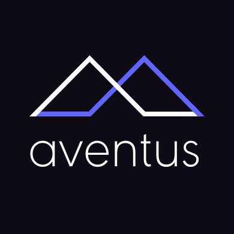
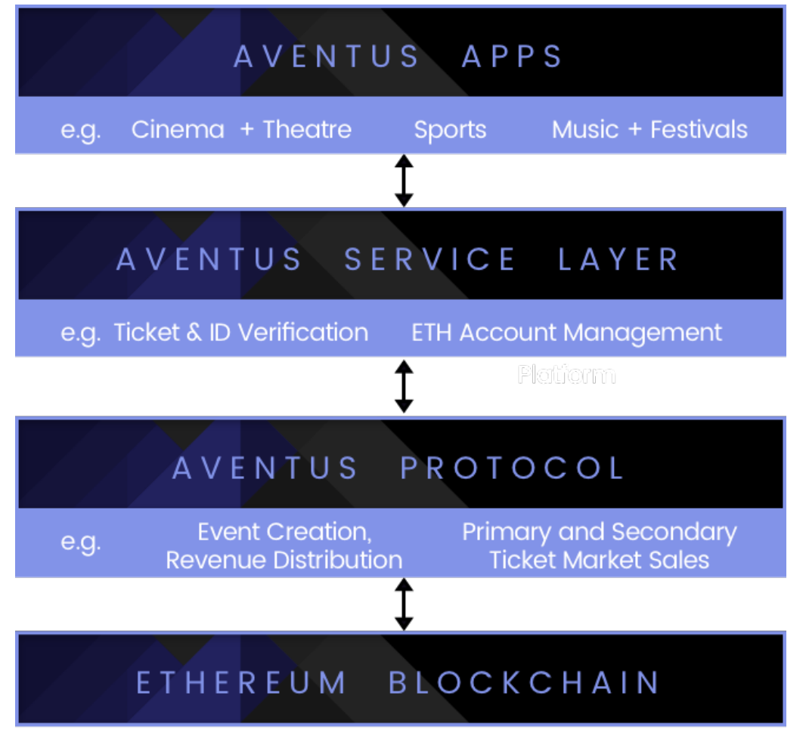
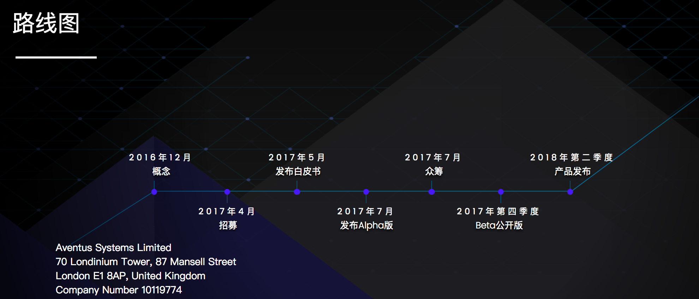

Aventus：用区块链技术减少票务市场欺诈
=====

概述
-----
* Aventus是基于区块链的活动票务解决方案，有效消除欺诈和不受监管的欺骗行为。组织者在极大地减少平台成本的同时，来创建、管理和推广他们的活动和票务，并能控制价格和在二极市场上获取佣金。

代币基本信息(数据截止2017-7-18)
----
* 发行日期：尚未发行（2017-7-19 23:00开启ICO）
* 市值排名：暂无
* 市价：暂未上市交易
* 交易量前三大交易平台：暂无
* 官网：[https://aventus.io/](https://aventus.io/)

市场关注度(数据截止2017-7-18)
-----
* 推特：1882
* slack：959
* 官网全球排名：397780

初始代币分配情况
-----
|比例|用途|
|----|----|
|60%|分配给参与众筹的投资者|
|19.5%|新用户奖励，市场推广|
|18%|分配给创始团队、顾问和合作伙伴|
|2.5|赏金活动|

代币总量：1000万。
众筹详情
------
|项目：Aventus|代币：AVT|
|:----:|:----:|
|开始时间：2017-7-19|接受币种：ETH|
|结束时间：2017-7-24|融资下限：600万美元或2.4万ETH|
|兑换比例：1ETH=92AVT|融资目标：1500万美元或6万ETH|

项目分析
-----
* Aventus是去中心化的协议，能用来创建更少欺诈和充满活力的活动票务行业。协议的代币—Avent（AVT）是实现其经济模型的关键。AVT可用来奖赏提供价值判断的参与者，例如对活动合法性进行投票、购买门票、推广活动和匹配买家和门票经销商等。

* 发起你的活动：注册并创建活动，收取的票费要比在线票务中心低。创建并发行门票。

* 设定你的票务市场标准：你可决定你的门票能否被转售，以什么价格转售，甚至可设定每次转售获得的费用。没有人能欺骗系统，所以不会再有假冒、不公平、不受监管的以你名义运作的票务黑市。

* 推广你的活动：使用基于区块链的微支付技术，为门票买家创建复杂的奖赏模型，进而获得更多的门票销售，极大地减少推广成本。

* 以极低的费用卖出和验证门票：用户使用APP和智能手机能容易、安全地在入口处验证门票。

* Aventus主要从以下方面着手解决当前票务产业中存在的问题：

 * 把控二级市场：根据票务公司TicketMaster的数据显示，60%左右的热门演出门票会在开售几分钟之内被黄牛刷走，以远远高于票面价格的售价在二级市场出售。黄牛赚得盆满钵满，活动组织方却损失惨重。阻止线下票务交易的模型是Aventus的核心。只要采用Aventus，活动组织方就可以保证他们规定的二手票最低价和最高价得到执行，并分得一部分二级市场的利润。
 
 * 区块链的安全特性：现有的票务交易体系无法让活动组织方保护好自己的门票，而二级市场很多时候又是黑市，行业监管难以到位，成为了滋生假票的温床，不仅扰乱市场秩序，还欺骗消费者。Aventus借助的区块链技术可以让每一张票都有唯一的标识符，永远不可更改。只要活动组织方在区块链上记录下这些票，基本上也就杜绝了假票。
 
 * 降低推广和平台成本：传统的活动推广渠道单一，而且只允许少数授权推广者进行推广，但Aventus支持所有安装Aventus协议的应用获取它列出的活动信息（除非被组织方屏蔽），有助于形成一个面向具体受众的全球性开放活动信息池。用户也可以在这些应用上卖二手票，交易成功还可以获得奖励。对于那些列出应用清单或交易成功并贡献了销售额的推广者，活动组织方可以给予一定的奖励。这完全颠覆了当前票务行业封闭的本质，采用多管齐下的方式提高销售额。

     
     生态系统
* Aventus团队结合区块链技术，打造了门票领域的区块链解决方案。他们通过设计搭建三层生态系统，尝试从根本上着手解决这一痛点问题：
 * 协议层：协议层由以太坊智能合约构成，支持创建和确认活动、在一级市场和二级市场中发行和销售门票、分配票务销售收入和市场/活动费用。为了让Aventus保持竞争力，并获得最高程度的普及，使用智能合约需要支付一笔费用。

 * 服务层：服务层的功能是让用户尽可能高效便捷地使用Aventus协议，特别是那些致力于打造主流票务应用的开发人员。服务层包含以下工具：

     • 以太坊账户管理平台：可以代表压根不了解加密货币的用户管理自己的账户、基金、交易。

     • 法币-AVT 兑换机制：这可以方便用户购票，支持组织方和应用开发人员快速提现，规避风险。可通过诸如 Uphold 或 MetalPay等第三方支付处理平台实现。

     • 门票和身份信息验证服务：这项服务会要求观众在入场时扫描脸部，并与购票时上传到区块链上的照片进行核对。这样可以减少浑水摸鱼的人数，同时让活动组织方记录下安保人员的表现。

     • 用户界面和整合工具模版：进一步方便活动组织方（如足球俱乐部）或推广者（如某个具有影响力的人）创建定制化的票务界面。

     • 除此以外，还包括活动植入广告工具，以及推广者以往参加类似活动时产生销售额的声誉计算工具。

 * Aventus团队会根据用户需求逐步增加服务内容。尽管这需要使用这些服务的开发人员支付一些额外成本，但会让票务应用的打造过程会变得非常简单。

 * 应用层：应用层由服务层（某些情况下是在协议层）上的应用程序构成。Aventus的第一款票务应用将主打体育和音乐产业，支持活动和相关票务的创建和管理，以及推广机制。Aventus还支持购票人收取奖励，方便快捷地找到其他演出信息。值得一提的是，Aventus会加强与第三方开发人员合作，争取让更多其他的应用程序在服务层上落户。

* Aventus团队的愿景是打造一个透明、安全和公平的票务交易平台。他们希望能通过构建这样一个完整的生态系统，从根本上革新当前的票务行业，重塑票务市场，利用去中心化的解决方案根除票务欺诈。

发展路线
-----
  

关注要点
-----
* **目前已发布alpha测试版。**
* **针对票务市场的区块链项目还有以下几个，可能存在较激烈的竞争关系：**
 * **Hello Sugoi（https://www.hellosugoi.com/events）** 
 * **Lava Movement（http://www.lavamovement.com/）**
 * **Guts（https://guts.tickets/#main）**
 * **Epass（http://espass.it/）**
 * **Ticketchain（http://www.launchbox.ie/ticketchain/）**
* **Blue Horizon Entertainment已与Aventus达成合作伙伴关系。**

关于币种分析文章，请关注小密圈ID：61818889，小密圈将作为第一发布平台，也可添加微信 liqi_studio 进群交流。

