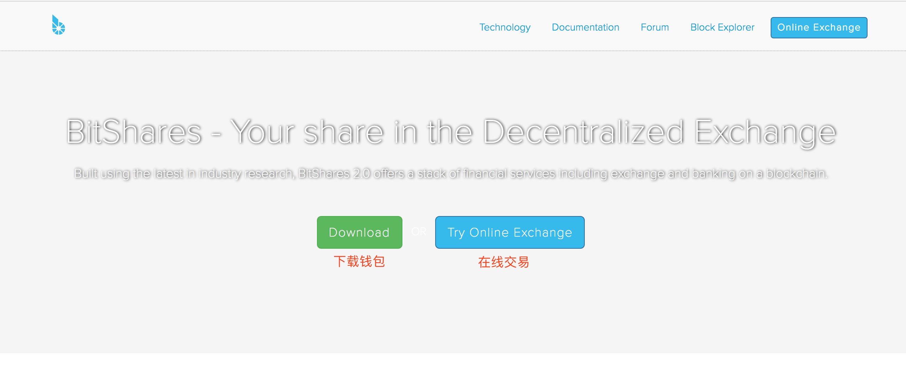

使用 MyEtherWallet(MEW)钱包参加ICO(众筹)的教程
=====

一 生成钱包
-----
* 第一步：打开网址：https://www.myetherwallet.com/，首页如下

* 第二步：切换语言，如下：

* 第三步：设置钱包密码，如下：

* 第四步：下载keystore文件（UTC开头的文件），一定要保管好，如果别人有了文件，就可以拿走你钱包里的资金，可以多个地方备份，如下：

* 下载完成后，点击继续，此时生成的是你未加密的私钥及二维码，作用如同Keystore File，同样需要安全保存。点击“打印纸钱包”如下图所示，您可以连接打印机打印出来，或者截屏保存，也可以导出PDF文件保存。

 

* 保存完毕后，继续点 NEXT：save your address 到这里你的钱包就已经创建成功了。

二 参加ICO
----
* 点击 发送以太坊，如下：

* 输入官方公布的合约地址（切勿相信其它途径的地址，地址错误就发送给其它人了），数量（不能等于账户余额，要预留矿工费），和gas limit（gas limit一般官方会给推荐数值，或者最高限额），生成交易即可，如下：

三 查看代币
------
* 点击“add custom token”，输入 合约地址，代币代码，和你想保留的小数位位数，保存
 
 
* 在“show all tokens”内找到代币代码，如果官方已经发币，则会显示余额。

四 充币／转账
-----
* 从其它钱包或者交易平台转币到钱包时，复制你的钱包地址过去，如下：

 
* 转账到其它钱包或者平台的操作步骤和参加ICO的步骤一样。

五 导入其它钱包
----
* 通过其它钱包备份的keystore文件和助记词，均可导入
  
 

* 以上就是用 MyEtherWallet钱包 参加ICO众筹的教程。
* **教程比较详细，相信大家都能轻松使用MEW钱包。想知道更多钱包如何使用，在小密圈(ID:61818889 加密数字货币研究院)内搜索“教程”可见。**
* **本圈(ID:61818889 加密数字货币研究院)致力于研究有实际应用价值，有技术创新的币种，发布研究报告，为价值投资者提供投资参考。**

