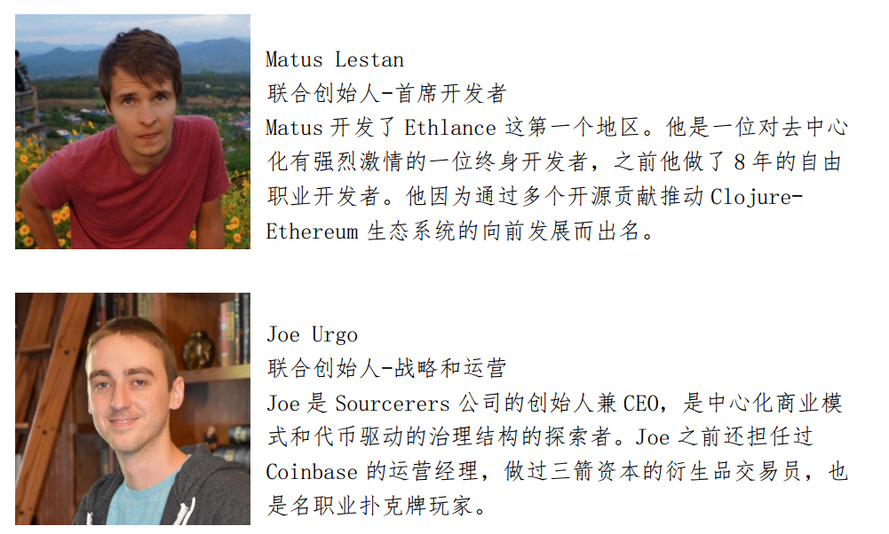
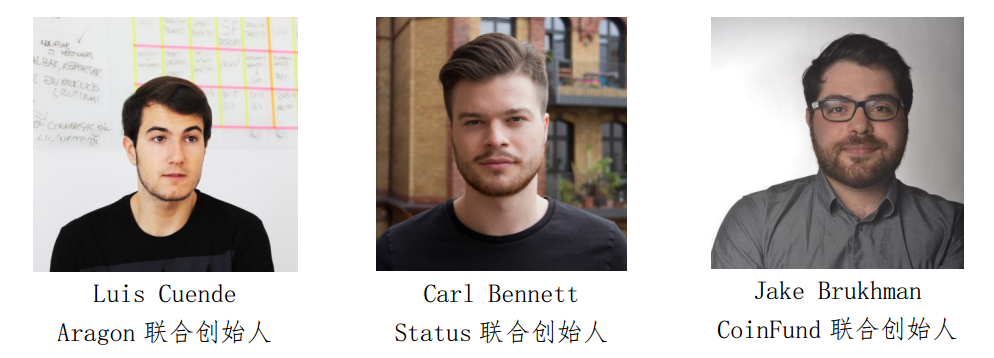
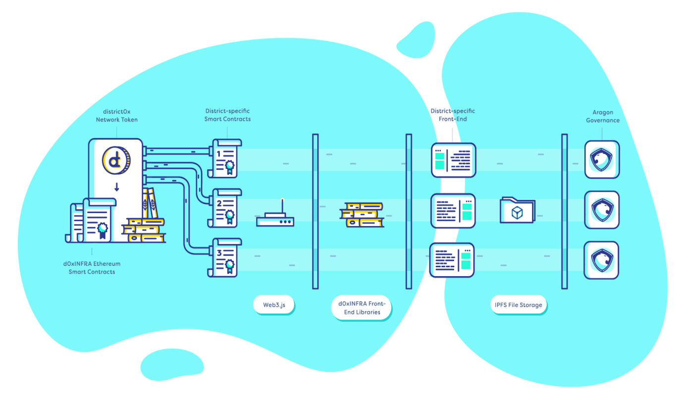
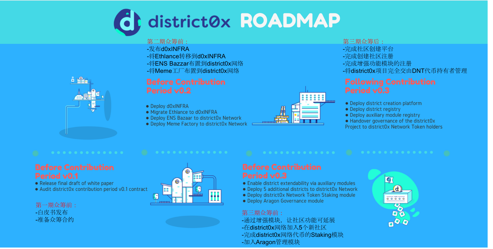

District0x：建立去中心化自治组织的集合网络
=====

概述
-----
* District0x网络是基于以太坊、Aragon和IPFS技术而创建的一个去中心化市场与社区的集合体，这些市场和社区称为District（地区）。这样的地区是district0x网络中的去中心化自治组织。这些地区都将基于开源框架d0xINFRA构建，d0xINFRA框架在Ethlance技术堆栈之后成型，包括以太坊合约和前端代码库。

代币基本信息(数据截止2017-7-14)
----
* 发行日期：尚未发行（2017-7-18 23:00开启ICO）
* 市值排名：暂无
* 市价：暂未上市交易
* 交易量前三大交易平台：暂无
* 官网：[https://district0x.io/](https://district0x.io/)

市场关注度(数据截止2017-7-14)
-----
* 推特：784
* slack：1449
* 官网全球排名：584639

初始代币分配情况
-----
* 代币总量10亿枚DNT；给未来的众筹阶段所预留的代币，只有在需要额外资金而且重要的路线图项目已经完成的情况下才会发放。否则将被销毁。创始团队的股份在2年内会被冻结。

 |比例|数量|用途|
|----|----|----|
|60%|6亿|分配给第一轮众筹期的参与者|
|20%|2亿|分配给创始团队成员(锁定2年或以上)|
|18%|1.8亿|预留给第二轮第三轮众筹|
|2%|2千万|分配给顾问及早期贡献者，包括“社区顾问项目”的相关参与人员|

众筹详情
------
|项目名称|District0x|代币代码|DNT|
|----|----|----|----|
|ICO开始时间|2017-7-18 23:00|软顶|1000万美元或等值ETH|
|ICO结束时间|2017-8-1，或达到软顶后48小时，或达到硬顶|硬顶|5000万美元或等值ETH|
|接受币种|ETH|兑换比例|按照投资者的出资占总出资比例分配代币|

* 公平的分配模式：为广泛地吸引DNT投资者，确保一个公平竞争环境：
 * 无白名单地址
 * 无第三方参与分配
 * 无奖金制度
 * 50Gwei最大gas价格
 

* “以太坊名称服务”为安全护航：为最大限度降低欺诈隐患，团队借助“以太坊名称服务”技术提供一种十六进制字符串的可读地址，确保项目支持者可通过 district.eth, district0x.eth或 districtox.eth三个地址参与众筹期的筹款活动。

团队
-----
 

顾问
------
 

项目分析
-----

* 市场创建和运营的标准：District0x网络是一个市场和社区的集合，这些市场和社区称为District（地区）。它在district0x网络里以去中心化的自治组织的形式存在。所有网民都将能够免费在网络上使用这些地区。所有地区都具有以下核心功能：
 * 发布和陈列
 * 搜索和过滤
 * 评级和信誉
 * 支付和开票据

* d0xINFRA架构：每个地区的核心部分就是d0xINFRA架构，它建立在由以太坊智能合约和前端库组成的标准开源架构上，由 IPFS为地区提供最基本的功能。
* d0xINFRA架构的设计是开放和可扩展的，通过使用辅助模块可以对地区进行定制化和添加额外的功能。
 
 
d0xINFRA框架

* Ethlance：发布于2017年1月，它是一个为自由职业者其全职工作者提供的去中心化的工作市场。它是district0x的第一个且将持续运营的地区。

* ENS集市：ENS集市现在正在开发中，它是一个交易通过Ethereum Name Service注册域名的点对点市场，为人们提供一个易于发现的ENS域名登记处，便于人们在此购买ENS域名。
* 迷因工厂：在district0x网络上即将部署的第三个地区是迷因工厂，迷因工厂将会提供一个在以太坊区块链上创建稀有数字资产的界面。这些数字资产可以立即发布到一个公告板风格的市场上进行交易。
* 未来的DISTRICT0X项目地区：district0x项目团队想继续往district0x网络上引入更多新的地区。同时作为沙盘来完善d0xINFRA架构，展示去中心化的市场和社区的功能。
* 创建你自己的地区：在部署地区创建平台以后，所有网民将能在district0x网络上快速创建自己的地区。由去中心化界面提供技术支持，district0x提供创建平台，可以绕开审查机构与中介机构。
* 通过社区进行管理：Aragon是一个部署后无法停止的公司和实体的革命性平台，是去中心化自治组织的操作系统。Aragon 改善了一个组织的基础管理，如有表决权股票的分配、投票、角色分配、会计、融资等等。简而言之，Aragon提供工具通过经济激励促进团队协作，让district0x网络得以实现。每当在 District 网络上创建一个地区时，将对应创建一个 Aragon实体，该实体将负责所有地区的治理流程。为了方便所有互联网公民公开参与这些治理流程，District0x 网络会利用本地区的代币，允许代币持有人将他们的代币存放在一个地区，以换取 Aragon实体的表决权股份。投票权将被用来从地区的行为准则到选择货币化的方式，以及如何利用或分配所产生的收入等 方面达成共识。

* 为了能让所有人自由加入、参与进一个district管理活动，为了让一个地区的参与者动机一致，也为了让district0x网络部署协同决议制定机制，引入了district0x网络代币。

* 在district0x网络中，互联网公民应享有自由加入任何地区并为其作贡献，与同地区参与者共商激励行为并实施相关协调决策机制等各项权利，为此我们推出了district0x网络代币。
* district0x Network Token (DNT) 是一种股权代币，持有者凭借其加入特定地区并参与管理。持币加入后，参与者将获得在该区的币值对等投票权。凭借投票权可全程参与地区各项活动，包含但不限于如下项目：地区品牌推广、制定共同行为规范、整合辅助模块，以及使用创收型辅助模块来筹集资金。
* 在district0x网络创建一个地区会触发Aragon网络创建一个代理实体，所有的管理活动会在这里进行。另外，DNT将被用来控制district0x网络的各方面。根据DNT持有量，持有者可以用他们的DNT来投票想要哪个district成为下一个部署对象。一旦Aragon在主网部署，附加的全网范围管理工具将被引进。

发展路线
-----
  

关于币种分析文章，请关注小密圈ID：61818889，小密圈将作为第一发布平台，也可添加微信 liqi_studio 进群交流。

