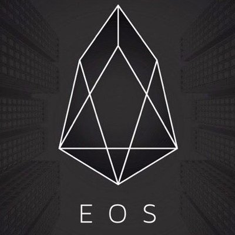

ICO-EOS(EnterpriseOperationSystem)-技术白皮书分析(part2)
=====

项目介绍
----
* 数字货币界的天才BM，到目前共开发了三个拳头币种，个个在币界赫赫有名。1.BTS比特股（代币已上市交易，应用已推出），主打去中心化交易所；2.STEEM（代币已上市交易，应用已推出），主打去中心化社区；3.EOS（即将ico），主打下一代智能合约。

项目分析
-----
* 共识算法：DPOS共识算法，全网代币持有人通过投票系统来选择区块生产者，在每个出快周期开始时，会选出21个区块生产者。

* 出块时间：3秒；如果在某个时间内没有成功出块，则跳过该块，如果一个出块着错过了一个块，并且在最近24消失内没有产生任何块，则该出块者将被删除，以确保网络顺利运行。

* 区块奖励：每生成一个块，奖励区块生成者新的代币，数量由所有区块生成者所公布的期望报酬的中位数决定，可能设置奖励上限，代币的年增长不超过5%。

* 社区福利应用：这三个应用程序最多能按配置的比例接受代币分配，额度=每年令牌配额-已支付给区块生产者的奖励。

* 交易确认：DPOS共识算法维护的区块链出块者一般都是100%在线的，只需要1.5秒，一笔交易可以认定为99.9%被区块链接收了。

* 账户：用户可以自行创建账户，账户可以创建分级管理。

* 升级协议和宪法：区块生产者提交修改变更，并获得17/21以上的赞成票，比例连续维持30天，所有用户使用新宪法的哈希值确认交易，区块生产者采用修改源代码的方式反映宪法变更，使用git提交的哈希值将变更提交到区块链上；区块生产者继续将17/21以上的赞成票维持连续30天，变更后的代码7天后生效，1周时间对所有节点进行升级，没有升级为新代码的节点将自动关闭。更新区块链来添加新功能需要2-3个月，修复不需要更改宪法的非关键漏洞需要1-2个月。紧急变更损害用户利益的有害漏洞时，可以加速变更过程，加速新特征更新或修改无害漏洞都是违反宪法的行为。

* 虚拟机：目前有三种需立即正在评估接入EOS系统：Wren／Web组件(WASM)/以太虚拟机(EVM)。

 |网站|链接|
|:----:|:------:|
|官网|[https://eos.io/](https://eos.io/)|
|ICO平台|未确定|
|twitter|[https://twitter.com/eos_io](https://twitter.com/eos_io)|
|steem|[https://steemit.com/@eosio](https://steemit.com/@eosio)|
|white paper|[https://github.com/EOSIO/Documentation/blob/master/TechnicalWhitePaper.md](https://github.com/EOSIO/Documentation/blob/master/TechnicalWhitePaper.md)|
|github|[https://github.com/EOSIO/eos](https://github.com/EOSIO/eos)|

* 因EOS官方暂未公布ICO细节，关于ICO的详细方案，我们将继续跟踪。请大家继续关注小密圈：加密货币投资分析（ID：61818889）

