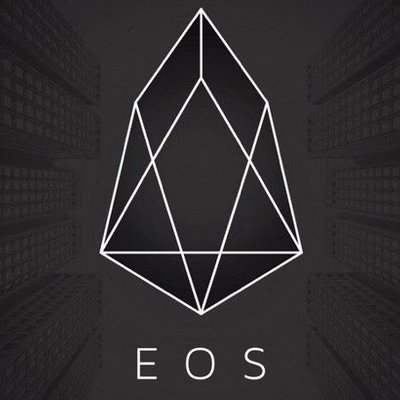

ICO-EOS(EnterpriseOperationSystem)-投资可行性分析（part1）
=====

项目介绍
----
* 数字货币界的天才BM，到目前共开发了三个拳头币种，个个在币界赫赫有名。1.BTS比特股（代币已上市交易，应用已推出），主打去中心化交易所；2.STEEM（代币已上市交易，应用已推出），主打去中心化社区；3.EOS（即将ico），主打下一代智能合约。

市场关注度（数据截止2017/6/5）
-----
* 推特：1185
* steem：619
* github：58

ICO信息
-----
* 尚未公布细节。

项目分析
-----
* EOS (Enterprise Operation System)为商用分布式应用设计的一款区块链操作系统，在分布式应用程序开发过程中，如果能有一个底层区块链操作系统就能大大降低开发难度，让开发者专注于更重要的事情－业务逻辑的探索。

 以现有的应用程序比如交易所和社交媒体为例，这些应用每天为数百万用户提供服务，每秒平均需处理的事件高达数十万条。作为一个区块链操作系统，如果同时支撑多个此类应用程序的, 系统需要达到更高的性能才可以。 假设有上千个应用程序，每个应用程序每秒处理一千个事件，这就要求底层操作系统每秒能够处理数百万次的事件。

 EOS这款区块链操作系统的强大性能，可以支持多个应用程序同时运行。实现这点是因为，整合了计算机图形学里的成熟技术，使得数千个应用程序能够在区块链上得以并行。

* 开发者友好的区块链底层平台：

 开发一个好的应用程序，需要从设计一开始就重点考虑用户体验。 因此，技术底层平台也必须做到对开发人员友好，而不是期望开发人员来适应某些技术的限制和特殊性。 EOS设计了一个类似于Facebook公司所创建的现代网站开发架构，大大简化了区块链应用程序的开发难度。EOS区块链系统可支持我们能想到的绝大多数商业应用场景。

* 类似与电邮系统的系统架构

 EOS的结构就像有一组人和机器人脚本，他们之间不断交换着信息。 它可以被认为是一个电子邮件系统，每个用户和机器人都在这个邮件系统里有一个邮件地址。像电子邮件一样，邮件具有发件人，接收者和抄送者。 也像电子邮件一样，邮件在发送出去以后，不一定能保证投递成功。 消息投递成功意味着接收方接受到消息并根据智能合约触发相应处理。不同于电子邮件的是，EOS里的收件人和被抄送人有能力拒收消息，在这种情况下邮件会传递失败。EOS的区块链是一个透明和永久的消息记录系统，记录了EOS系统内部所有传递成功的消息。

* 跨链消息传递机制

 由脚本或机器人生成的消息首先作为“未传递的消息”包含在块链中，并在所有收件人接受它们之后再被标记为传递成功。 之所以把还未传递成功的消息记录到区块链中，是为了便于与其他区块链的通信。这将允许EOS上的应用程序与其他区块链上运行的应用程序进行交互和操作。

* 独立的脚本语言

 EOS架构可以同时支持多种编程语言。 EOS将首先支持Wren和Web Assembly，但它也可以支持任何其他合适的高性能sandboxed语言。

* 免费的区块应用程序

 与其他平台不同，EOS上的应用程序不需要用户为区块链上的操作支付费用。像传统的基于Web的应用程序一样，EOS应用程序开发人员提供程序运行需要的资源，而不是由用户提供。这些资源包括带宽、计算力、存储容量等。这意味着我们可以创建免费的区块链应用程序，新用户无需经历繁琐的电子货币购买流程，就可用直接使用区块链上的应用程序。

* 协同效应

 EOS使得大规模分布式应用程序得以相互通信，这是在之前底层区块链平台上不可能实现的。 构建在EOS的分布式应用程序，不光用户可以相互导流，而且这些分布式应用程序还可以给彼此提供区块链相关服务。

 
总结
-------
* 大家都知道，区块链应用最大的限制就是数据吞吐量，EOS通过并行链和DPOS的方式解决了延迟和数据吞吐量的难题，将处理速度扩展到每秒数百万次的交易，并将区块链带入主流商业。

* EOS率先支持的WREN编程语言在BM之前的博文中有过描述，是一种十分高效的编程语言。

* EOS和ETH的愿景大致相似，一个操作系统的底层，在这个操作系统里，可以构建各种各样的智能合约应用，并且又因为并行链而使得EOS系统里的每一个软件都可以获得高性能支撑。类似BTS/STEEM这种每日交易次数超过BTC和ETH的真正意义上的应用，只有EOS上可以构建。    

 |网站|链接|
|:----:|:------:|
|官网|[https://eos.io/](https://eos.io/)|
|ICO平台|未确定|
|twitter|[https://twitter.com/eos_io](https://twitter.com/eos_io)|
|steem|[https://steemit.com/@eosio](https://steemit.com/@eosio)|
|white paper|未公开|
|github|[https://github.com/EOSIO/eos](https://github.com/EOSIO/eos)|

* 因EOS官方暂未公布ICO细节，关于ICO的详细方案，我们将继续跟踪。请大家继续关注小密圈：加密货币投资分析（ID：61818889）

