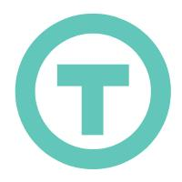
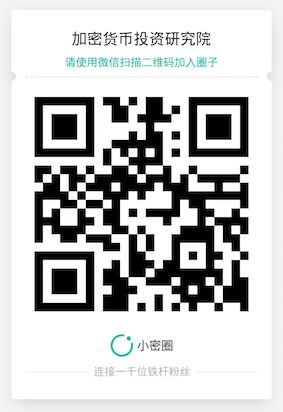

WeTrust(TRST互信币)-互信金融平台分析
=====

概述
-----
* WeTrust团队致力于通过利用现有的社会资本、人际信任网、以及创新的区块链技术带来全新的金融产品服务。第一个产品的灵感是来自于全球超过10亿人已经在使用的“社区信用贷款” (俗称：标会)。WeTrust.io的技术能有效强化这种传统借贷方式，并使其更加规范有效率。用户通过WeTrust可在Ethereum区块链上自主创建和管理数字标会。组建新的标会，构思个性化的协议，并且参与管理交易和会员记录。由于标会协定将以智能合同的形式编入原代码中，会员需要提供真实的身份信息。不守规矩的会员将会从信誉系统中移除。

基本信息(数据截止2017/6/12)
----
* 发行日期：2017/4/20
* 市值排名：66
* 交易量前三大交易平台：Bittrex/Liqui
* 官网：[https://www.wetrust.io/](https://www.wetrust.io/)
* 区块链浏览器：[https://etherscan.io/token/Trustcoin](https://etherscan.io/token/Trustcoin)   

市场关注度(数据截止2017/6/12)
-----
* 推特：4938
* github：33
* slack：1663
* 官网全球排名：184193

创立
-----
* 联合创始人和CEO，George Li在南亚印度等地见到：当地的熟人圈子借款，发展的颇成体系，关系紧密的小团体，内部资金共享，几乎等于拥有了自己的私家银行。于是他考虑：能否依靠技术，让这种模式变得更为简单和可靠。这便有了ROSCA DAPP这个产品。

项目进展
-----
* 最近更新：2017二季度将支持多种加密货币；2017四季度区块链身份识别及信用评分。

核心团队（部分）
------
* George Li（CEO）：曾在谷歌的公司战略和基础设施部门任职, 并且曾是麦肯锡咨询公司(McKinsey)的一名顾问. 拥有斯坦福大学管理科学工程硕士学位和罗格斯大学电气与计算机工程学士学位.

* Patrick Long（COO）：Patrick之前曾在RMS公司从事金融工作, 且曾在安永会计师事务所(Ernst&Young) 担保服务部门任职并在那里获得了自己的CPA职称. 拥有加州大学伯克利分校经济学学士学位.

* Shine Lee（智能合约开发人员）：Shine是一名Ethereum(以太坊)方面的加密货币专家, 大学毕业后一直专注于此. 他是一名Ethereum(以太坊) 挖掘者和可靠性开发人员, 毕业于加州大学戴维斯分校, 拥有该校的计算机科学学士学位.

* Mivsam Yekutiel（项目研究和业务发展）：新西兰奥塔哥大学量子力学博士。在过去20年间，其致力于教学和志愿服务等社会影响项目。

项目顾问
-----
* Vitalik Buterin：以太坊创始人，去中心化网络3.0发布平台项目Ethereum的创始人，也是《Bitcoin Magazine》的联合创始人。在2014年因为创建Ethereum项目获得了世界科技大奖。

* 沈波：分布式资本创始人，沈波先生是Invictus Innovations Incorporated的创始人之一，这是BitShares项目的创始团队。他也是传统金融的资深人士，在证券、对冲基金和投资银行等行业拥有超过12年的丰富经验。

* Brian Hoffman：OpenBazaar创始人兼首席执行官。OpenBazaar是一个开源的项目，建设去中心化的在线商业运用。在创办OpenBazaar之前，Brian曾经创立过多家网络公司，并且曾在Booz Allen Hamilton and Accenture任职顾问。 Brian在詹姆斯麦迪逊大学获得电脑科学学士，并于约翰·霍普金斯大学商学院获得工商管理硕士MBA学历。

* Emin Gün Sirer：区块链顾问，副教授，华盛顿大学计算机博士，普林斯顿大学计算机硕士。目前在康奈尔研究操作系统，网络以及分布式系统。其为“黑客社区”的代表成员，运营着名为”黑客分布式“（Hacking Distributed）的技术博客，并在博客中对现有的技术发表评论。同时，其为“IC3”——一家加密货币和合同倡议的联合理事。

* Michael Casey：金融科技顾问，康奈尔亚洲研究专业硕士，西澳大利亚大学商业专业学士。麻省理工学院媒体数字货币倡议的高级顾问，也是Agentic集团的合伙人。作为经济、金融和信息技术领域的作家和研究学者，其也是“华尔街日报”（Wall Street)的资深记者。

* Michael Hexner：企业发展顾问，克莱顿大学冲突和争端解决的理学硕士，威廉姆斯学院政治理论专业的学士。其为经营公司超过40年，为零售和技术领域(Wheel Works, SmartPillars, Fundamental Capital等)的资深企业家和投资家。其在创业方面有丰富的经验，能通过发现实际问题并构建清晰的愿景来领导所在团队。

* Benedict Chan：区块链顾问，在BitGo担任工程总监, 具有创建区块链和钱包平台的丰富经验. 他曾创建了Ether.Li——首个多重签名的网上钱包. Ben在智能合同, 钱包和安全事项方面为团队提供建议. 他拥有澳大利亚南威尔士州大学计算机科学学士学位.

（关于币种分析报告，请关注小密圈ID：61818889 加密数字货币研究院，小密圈将进行长期的追踪分析）
项目分析
-----
* 第一款产品(注：ROSCA已上线)：WeTrust正在开发的产品是借贷圈(TLC)，它仿照传统储蓄模型，该模型在全球范围内被超过10亿人使用，英文的正式名字是Rotating Savings and Credit Association (轮转储蓄与信贷协会)，在中国俗称为“标会”。标会是由一群可信赖的会员协议产生的定期、定额贷款。每个标期，任意一位会员以一种类似竞价机制获得所有的贷款。前期中标的会员相当于获得短期的贷款，之后不能再次投标，直到所有会员都标得一次贷款。最后一位中标者，则从前几轮的储蓄中获得利息。这种标会储蓄的概念全球有超过十亿用户使用，其中很多用户是没有银行账户或是难以获得正规银行服务的人。所有人都能通过app创建或加入标会，自由制定协议(每期存款额度，周期长度)。

 这里举例说明“标会“是如何具体操作的：虽然这种架构是一种“零和博弈”，但标会也具备如下性质：会员获得最基本的保险并且累计信用;利息流动于标会内;无需依靠“可信赖第三方”，享受较低的利率。
  
 为了保证平台的公信力，传统的ROSCA在资金存管上采取第三方托管的形式，并配以专门的审计机构。而区块链平台使得公信力不基于标会会主和审查机构，而是基于公开透明的算法，这有利于降低运作成本，具体优势体现在以下三点：
 1. 所有资金流向是公开透明的，无法伪造和篡改。

 2. 资金的划转只能按照公开和预设的智能合约(即以太坊的Smart Contract)执行，无法人为挪用。

 3. 参与者的个人数据都会被加密，保护隐私。
　　　  
  
  此处给大家通俗的解释一下ROSCA DAPP的运作方式：在这个平台上，用户可以拉入自己认为可靠可信赖的人，组成一个小团体;每隔一段固定的时间比如一个月，团体内的人就需要向以太坊的“智能合约”中存入一笔钱(这笔钱并不在WeTrust手中);一旦团体中有人需要借钱，就采用“竞标”的方式——比如四个人都希望把现有的40元借到手，那就分别给出报价，结果A报出35元的最低价从而中标，这个意思就是：A只能花其中35元，剩下5元要给团体中存钱的人作为利息。因此把钱存入“智能合约”是能赚钱的。

 WeTrust在搭建平台以外，也最大化为用户提供保障，降低违约风险。控制风险的方式除了上文谈到的三点优势，还包括：熟人团体内，每个人都知道其他人的联系方式甚至直接就认识他们(这意味着违约后果很严重，可能再也无法混原来的圈子);借款的人可以提供车和房等实物担保;一旦有人违约，可以把坏账卖给专业的催收账单公司，以减少损失。
　
　而基于熟信的ROSCA平台是纯信用中介，用户风险自担，钱都是借给了你熟知的朋友，信用风险由你自己衡量。如果ROSCA可以成为民间借贷的基础设施，可以帮助线下本就存在的民间借贷的形式网络化。这是一个现成的市场，也是很有前景的事情。但这也有可能是一笔危险的生意，因为把业务从线下搬到线上，或者利用区块链技术并不能根除民间借贷的根本风险点。

 在监管不到位的情况下，民间借贷市场每隔几年就会经历一场生死周期， 伴随着经济上行，暴利行业崛起，从众而好赌的人群会赚的体满钵满，还不知满足的疯狂的加杠杆。而一旦到了光景不好的时候，资金压力紧绷，牵扯到熟信和社会关系的连环借贷就会系统性的崩盘，本来称兄道弟的人际关系也会崩溃。这是人性的问题，不是单靠技术可以解决的。

* WeTrust的工作原理：

 用户通过WeTrust可在Ethereum区块链上自主创建和管理数字标会。组建新的标会，构思个性化的协议，并且参与管理交易和会员记录。由于标会协定将以智能合同的形式编入原代码中，会员需要提供真实的身份信息。不守规矩的会员将会从信誉系统中移除。起初，WeTrust使用以太币作为主要货币，将来会接受其他的加密货币。交易手续费将通过自带的TrustCoin支付。TrustCoins也会用于奖励介绍新会员、管理标会以及在WeTrust平台上提供贡献的会员。

（关于币种分析报告，请关注小密圈ID：61818889 加密数字货币研究院，小密圈将进行长期的追踪分析）

* 关于标会的几点问题：

 1. 地域局限性：传统的标会很难大规模扩张。一般而言，会员必须处于同一社区，以参与决议和亲自向管理员支付存款。正因如此，大型的标会难以成型，也同时限制同一会员同时参与多个标会。

 2. 缺乏执行工具：传统标会缺乏有效的防欺诈机制

 3. WeTrust采用四种方法限制恶意用户：
 
 a. 信誉风险/互评：标会参加者将限制在“可信赖会员”范围内——家人、朋友、同事、兄弟会、专业协会/宗教组织。拖欠会款的会员会被排斥，在亲友间失去面子信誉。这也是符合WeTrust的理念，将标会的规模和存款额度限制在适当的范围内减低信用风险和确保会员间的诚信，会员间互评也为之后的交易提供可靠依据。
 
 b. 法律风险：通过电子签名的合同具有法律效力，熟人之间互相绑定，确保彼此履行付款。会员需要为自己的违约或盗窃等行为承担法律责任。只有在标会会员个人风险高的情形下，司法程序才会具有意义。法律顾问认为我们的平台存在为每位标会会员创建自动填充的合同模板的可能。

  c. 抵押风险：会员需要担保/抵押加入标会。抵押物将被纳入智能合同，如果违约的话会被充公。抵押可以是流动性高的资产，比如比特币，或者固定资产比如私家车、房产。系统从流动性弱的固定资产中受益，因为大多数中产阶级的资产套在房地产。抵押可以提高资本的利用效率。

  d. 智能合同奖励金(自我执行)：假如会员违约，为了追回资产，标会将发起一种奖励金。奖励金会在追回后付给帮助追回的会员。

 这些预防机制是基于自愿原则，会员可以自行设定其安全性，这些在实际运用时都比较灵活，可以根据标会特性相应的修改。我们正致力于实现前两点 (信誉风险/互评以及法律风险)。

* WeTrust的解决方案：WeTrust致力于利用区块链和移动技术解决标会现有的不足，特别是针对中国和印度等发展中国家的中产阶级用户。区块链消除中间商;WeTrust致力于通过区块链技术解决标会低效率的问题;区块链促进标会透明化,所有关于标会的重要信息将安全准确地在区块链上自动存档,这些档案将对所有会员公开;区块链去除第三方管理的必要,区块链技术实现自动付款和归档,用户因此可以自行管理标会，无需外界介入。

* 什么是TRUSTCOIN（互信币） 以及其在WETRUST是如何运作：

 TRUSTCOIN(TRST)是为WeTrust及其它运营商提供服务而设立的货币。在标会中，虽然会员可自定货币(例如ETH，BTC等)，组织者还是得通过TRST币打赏标会内的其他成员。值得注意的是，虽然其他加密货币在标会内部都可流通使用，但通过TRST币支付可享受很多折扣，因为其运营成本会更低。

 标会成立时，组织者规定征收的手续费，一般是全部资金的百分比，以TRST的形式犒赏。举例：假设一个标会有5位会员集资100美元，费率是2%，那费用就相当于每期 5* 100* 2%=10美元。此外，WeTrust还收取约0.3%的运营费，用于开发之后新的产品。

 每期结尾时，会员可以将TRST币兑换成其他虚拟币(比如bitcoin, ether)，根据标会合同由智能合约托管。组织者和WeTrust应收的费用都会在标会结束时(没有违约的情况下)以TRST币支付。

* 作为网络抵押的TRST：组织者的奖励机制，在零违约的情况下，组织者才能获得全部贷款。假设部分会员违约的话，组织者将受到惩罚，部分收益会被扣除。为了增加参与者的信心，组织者(假设是第一轮竞标，之前其他会员对领头人一无所知)也会自掏腰包，将TRST分配给信誉比较好的会员，预防拖欠的情况发生。参与者也可根据自己的意愿交纳押金。标会网中其他需要累积信用的角色，也可以通过押金的激励形式来实现(例如保险理赔人)。

众筹资金使用分配
------
* WeTrust的ICO众筹资金将用于平台5个主要的方面：

 1. 用于研究不同的数学与统计模型，精算模式，建立电脑算法，确保用户能获得合理的奖励回报。
 2. 用于软件开发，开发智能合约、建构安全系统和用于强化用户体验等。
 3. 用于业务发展：与其他非营利的区块链组织达成合作，雇用社区经理，全球化推广互助借贷(标会)。 
 4. 用户市场营销：教育公众、赞助区块链活动、建立品牌、提供奖励吸引用户等。
 5. 外部开销：包含建立代币销售的架构，税务审计、法律费用、应付固定开支等。
　
* 代币总量：1亿，不增发；80%通过ico售出，10%团队预留，并锁定两年，10%为平台赏金。

总结
======
* 代币分配合理，团队仅预留10%，并锁定两年，不存在创始团队套现问题。

* 流动性：目前国内无交易所上线，主要成交量集中在b网，期待能在更多交易平台上线，成交量较低。

* 团队：顾问团中不乏圈内大牛，开发团队比较低调。

* 项目方向明确，开发进度稳定。

**关于币种分析报告，请关注小密圈ID：61818889，小密圈将作为第一发布平台，也可添加微信 liqi_studio 进群交流,如需转载本圈文章，必须经得同意。**

