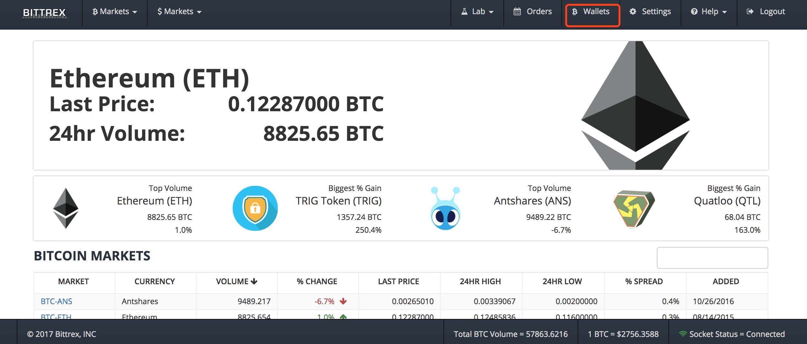
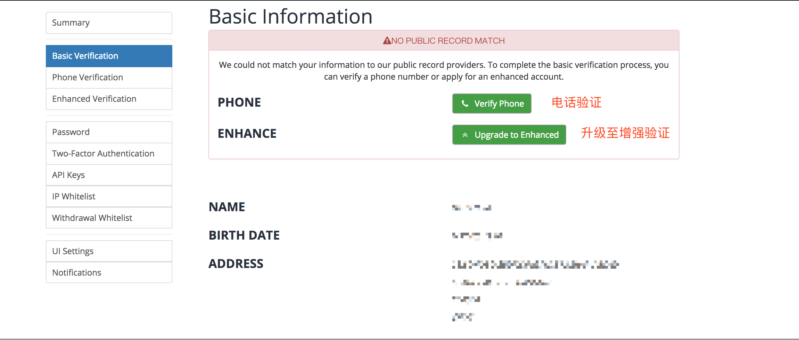

国外交易平台B网(bittrex.com)使用教程(含高级验证)
=====

一 注册
-----
* 第一步：打开网址：https://bittrex.com/，首页如下

* 第二步：点击“login”，如下：

* 第三步：点击“sign up”，填写注册信息，**验证码需要翻墙(如何翻墙请百度)才能显示**，如下：

* 第四步：请至注册邮箱激活账户，如下：

* 第五步：登陆邮箱，点击链接进行验证，如下：

 

* 注册过程就此完成，可以登陆账户了。

二 充币／提币
----
* 登陆账户，如下：

* 点击“wallets”，如下：

 
 
 
* 充币，点击“+”，如下： 
 
 
  
  
* 提币，点击“-”，如下：
 
 
三 交易
------

* 
 
  

四 高级验证
-----
* 点击“settings”，进行基本验证，如下：
 
 
 
* 手机验证，如下：
 
 
 
* 增强验证，如下：
 
  
  
  
  
 

* 以上就是用 B网（bittrex.com） 的教程。
* **教程比较详细，相信大家都能轻松使用B网进行交易。想知道更多国外交易平台如何使用，在小密圈(ID:61818889 加密数字货币研究院)内搜索“教程”可见。**
* **本圈(ID:61818889 加密数字货币研究院)致力于研究有实际应用价值，有技术创新的币种，发布研究报告，为价值投资者提供投资参考。**

