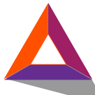

ICO-Basic Attention Token（BAT）-投资可行性分析
=====

项目介绍
----
* *在线广告令人厌烦，单看广告屏蔽软件数量的增加就可以看出来。为了解决这个问题，Brave浏览器公布了新的网络用户激励办法：主动删除广告，但是愿意打开广告的人可以获得奖励。*
* *Brave已经公布了比特币支付方案，将用户提供的比特币分发给最喜爱的网站，鼓励无广告的内容消费体验。为了扩大该服务，Brave将发布新的基于以太坊的数字广告平台，由用户关注度替代挖矿算力或黄金支撑的一种全新模式。*
* *而且该平台使用权也许不限于Brave，因为其代码将按照开源许可证规定，在Github发布。*
* *该网络使用的数字代币是Basic Attention Token（BAT），计划年底以类似“空投”的方式向注册用户发行，也面向投资者和Brave团队。*
* *Brave创始人Brendan Eich称，大约70%的已有代币将向投资者出售。20%代币将尝试性分派给Brave团队。余下的10%作为“一次性首次津贴”分发给用户。*
* *利用此次发行代币，Brave希望 “给用户带来切实利益，这个代币类似我们给用户的小型最低收入补贴。”*

代币分配方案
-----
* 后续不增发，总量10亿。 

 |比例|分配方案|明细|
|:----:|:------:|:----:|
|70%|ICO|用于BAT生态系统的开发和发展，其中包括基于Etherey的智能合约系统和Brave浏览器。|
|20%|开发团队|用于开发，营销，运营和其他成本|
|10%|用户增长池|将用于激励用户下载Brave浏览器|

*注：作为下载Brave浏览器的激励代币只能在浏览器系统中使用（消费或捐赠）。任何在指定之间内未被用户使用的BAT将被返回到池中。一旦用户增长池用尽，将不再增加增长池中的代币。*

* ICO兑换比例：兑换币种及兑换比例尚未公布。

* **发行前项目方将ICO数据进行了调整，以下为最终数据：**
* 总量15亿

  |比例|分配方案|明细|
|:----:|:------:|:----:|
|67%|ICO|用于BAT生态系统的开发和发展，其中包括基于Etherey的智能合约系统和Brave浏览器。|
|13%|开发团队|用于开发，营销，运营和其他成本|
|20%|用户增长池|将用于激励用户下载Brave浏览器|

* ICO兑换比例：1eth=6400bat。

项目分析
-----

* **搭建在比特币区块链上**：BAT分阶段发行，目的是消除第三方广告商及其带来的大量数据浏览体验，降低搜索和下载时间，同时形成用户、广告商和出版商之间的交易生态系统。白皮书详细阐述消除中间商如何给每个参与方带来新的效率，同时可能扩大交易对手方的的利润率。
  * 观看广告的用户将获得BAT代币奖励。BAT可用于Brave平台上的优质内容或服务。
  * 发布商将获得广告收入总额的大部分份额。用户还可向发布商捐赠代币，增加发布商的收入。
  
* 去年10月开始Brave就已经开始测试该理论，让用户向出版商支付比特币，换取无广告的浏览体验。一开始传统媒体成员批评浏览器承诺拦截广告的做法，但是去年Eich将产品定位为夺回其他服务抢走的收入的方法。
* 出版商可以分步骤证明他们可以管理好创作原创内容的网站，并获得用户存储的比特币。但是该浏览器底层的Brave账本（Brave Ledger）仍是用户体验的中心化组成部分。该账本以安全的加密方式计算用户对浏览器的忠实度，不会泄露用户个人信息。每个月末访问量最多的五个网站将获得比特币。
* 将该服务与基于以太坊的网络融合，Brave将逐步开发完全去中心化的产品。

* **开源平台**：BAT代币在以太坊网络上发行，而不是Brave账本，因此它是开源的。
* 1.0版本BAT钱包将与Brave浏览器融合，公司自己的账本进行交易及验证。之后的版本中，验证流程将完全转移到以太坊，使浏览器不容易被关闭。
* 尽管Brave实质上还是中间商，会获得一部分广告收入，在Github上发布代码可能形成基于以太坊的浏览器生态，以及以多种方式进行小额交易的基于关注度的产品。
* 但是向以太坊转移并不表示支持以太币。Eich说Brave将继续支持比特币支付，将来才可能增加其他支付方式。
* “比特币处在压力下，以太币发展迅速。我们不想在这里判定输赢”。
* 为了实现开源的、不区分区块链的模式，Eich的团队目前在探索Zcash的原子化跨链交易（XCAT，cross-chain atomic transactions），这个近期即将发布的功能是为了让多个区块链进行交互。Eich表示：
"我们知道选择很多，也意识到升级与交叉的存在。我们并不知道将来世界的样子，但我想说是区块链、智能合约与类似区块链的私人协议”。


团队
-----
* 创始人Brendan Eich：javascript创始人，brave联合创始人，mozilla基金会／firefox联合创始人。
* Brian R. Bondy：主管开发人员，brave联合创始人。曾就职:可汗学院， mozilla基金会，印象笔记。    
* 团队核心人员11人，顾问4人。

项目关注度
-----

* twitter：1557（BAT）/ 1.49万（brave）
* slack：1133(BAT)
* github：4871(brave)
* reddit：542(BAT)
* medium：421(BAT)

（截止发布日期：2017/5/22）

众筹情况（更新）
----
|项目介绍|||
|:----:|:------:|:----:|
|项目名称：Basic Attention Token|代币简称：BAT|代币总量：15|
|ICO时间：2017/5/31|接受币种：eth|ICO总量：10亿 BAT|
|第三方背书：否|最低目标：1080万美元|最高目标：2400万美元|

|网站|链接|
|:----:|:------:|
|官网|[basicattentiontoken.org/](http://www.basicattentiontoken.org/)|
|ICO平台|官网及imtoken|
|twitter|[twitter.com/@attentiontoken](http://www.twitter.com/@attentiontoken)|
|medium|[medium.com/@attentiontoken](http://www.medium.com/@attentiontoken)|
|slack|[slack.basicattentiontoken.org/](http://slack.basicattentiontoken.org)|
|white paper|[basicattentiontoken.org/wp-content/uploads/2017/03/BasicAttentionTokenWhitePaper.pdf](http://basicattentiontoken.org/wp-content/uploads/2017/03/BasicAttentionTokenWhitePaper.pdf)|

项目总结（更新）：
------
1. brave浏览器已支持ios／Android／Windows／macOS／Linux设备，使用流畅，BAT代币上线后，团队将会把BAT多重签名钱包集合进brave，并开发BAT插件，支持其他浏览器。
2. ICO发币67%，最多筹集2400万美元；团队预留13%，临时提高ICO上限及降低ICO代币发放比例引起较多人不满。
2. 团队创始人Brendan Eich为js创始人，Mozilla和Firefox联合创始人；团队技术可靠。
4. 项目在市场中关注度较高，ICO开始30秒即结束。

**关于ICO项目分析文章，请关注小密圈ID：61818889，小密圈将作为第一发布平台，其他平台将在ICO结束后发布。**

