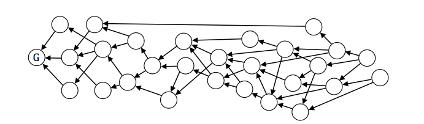
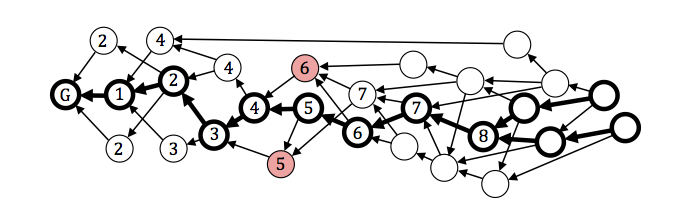

Byteball（字节雪球）- 基于DAG技术的存储和传输价值的去中心化系统
=====

概述
-----
* Byteball(字节雪球)是一个存储和传输价值的去中心化系统，允许任意数据的防篡改存储，包括可转移价值的数据，例如货币，产权，债务，股份等。这些存储单元彼此链接，每个存储单元包括一个或多个早期存储单元的散列值，既用于证实早期的单元又用于确立它们的偏序关系。链接单元之间形成DAG（定向非循环图）。没有管理或协调新单元进入数据库的单一中心实体，允许每个人添加新的单元，只要他签署并支付的费用等于添加数据字节的大小。其他后来用户通过自己单元内的散列值来确认早期单元，并收取费用。随着新单元的添加，每个早期单元，包括其中的散列值，直接或间接的接收越来越多后来单元的确认。Byteball中没有区块的概念，也没有区块容量的问题。

基本信息(数据截止2017-7-10)
----
* 发行日期：2016-12-27
* 市值排名：24
* 市价：4383.29 CNY
* 交易量前三大交易平台：Bittrex／Cryptox／Cryptopia
* 官网：[https://byteball.org/](https://byteball.org/)

市场关注度(数据截止2017-7-10)
-----
* 推特：3322
* slack：3455
* 官网全球排名：137389

代币
-----
* 没有ICO或众筹。
* 总供应量：1000万亿(10的15次方)， 所有的bytes将在创世块交易中发行，总量不变。
* 98% 的bytes和blackbytes(私有不可追踪的货币) 将会分发给比特币或者Bytes的持有者，在发布之前将他们的比特币与byteball地址进行关联。无需投资，只需要持有比特币，就可以获得bytes和blackbytes。为了关联byteball和比特币地址，用户需要向专门创建的比特币地址中发送少量的比特币。接下来，用户可以将其所有的比特币合并到发送少量比特币的地址中，这样就可以知道这些比特币都是同一用户控制的(如果只有一个比特币地址，请忽略这一步，因为所有的比特币都在一个地址中了)。在发布之时，用户收到的bytes和blackbytes将与其在某个指定的比特币区块高度时所持有的比特币成正比。
* (注：2017-7-9第七轮分配完成，下一次分配时间为2017-8-7)。
* 1% 预留。
* 1% 将会分发给安装Byteball钱包的前1亿用户，每个用户100 Kbyts。

项目分析
-----
* Byteball中没有区块的概念，也没有区块容量的问题。相反，每一个新的交易都通过包含和签名它们的哈希来参考更早(父母交易)的一个或几个交易。交易中的链接形成了一个DAG(有向无环图 )。

* `directed acyclic graph 简称DAG,有向无环图`
 *  目前采用这个技术有IOTA、byteball两个加密货币，这种技术解决了目前blockchain的短板，可以实现高并发和迅速到账，当然也牺牲了一些安全性。其安全性低于POW共识机制，持平于POS和DPOS机制。但是DAG的（TIPS）每秒转账能力和可扩展性，远远高于目前blockchain的形式。

* 通过包含它的父母交易，每一个新的交易也可以间接地包含和确认所有父母交易的父母，父母交易的父母交易的父母，以此类推。随着添加的交易越来越多，你收到的确认数也会像滚雪球一样一直增加，这也是为什么命名为Byteball的原因。
  
  
* 共识：没有PoW，也没有PoS以及挖矿。相反，因为使用了DAG，它可以在交易之间建立部分有序，加上在DAG中添加的主链:

  

* 主链 (MC) 允许在交易之间定义完整的顺序: 已经包含在主链中的更早交易(直接或间接)在完整顺序中也视为更早。当出现双重花费时，在完整顺序中出现较早的交易被视为是有效的，其它的交易则视为是无效的。主链是基于图像中交易的位置来确定的。全序通过选择一条单链建立在 DAG（主链）上，吸引由被称为见证人的已知用户签署的单元。在主链上较早包含散列值的单元被认为在全序上较早。用户通过在每个存储单元中命名用户信任的证人来挑选见证人。见证人是具有现实世界身份的信誉良好的用户，这样命名他们的用户期望他们永远不要尝试双重支付只要大多数见证人表现得如预期的那样，所有的双重支付尝试会被及时检测到并且被标记。

* 交易费和内在价值
 * 在Byteball数据库中支付的用于保存某个交易的费用等于所存储数据的大小。如果你的交易容量是500字节，你正好支付500 bytes(Byteball的原生代币)的交易费。这意味着，在这些bytes中存在内在价值：它将同样大小的数据永久地存在一个去中心化的不可更改的数据库。对于那些代表着金融交易的数据，价值就是社会的，而不仅仅是个人的，因为你需要存储所有的历史记录来能够证明每一个所有者拥有的钱币的价值和真实性。
 * 部分交易费被首先参考你的交易作为父母交易的用户所获得，另外一部分交易费则被见证人所获得。前者激励将最近的交易参考作为父母交易，从而实现了DAG只在一个方向增长。就像树干一样，尽可能缩小网络延迟。如果新的交易非常少，这样的话在新的交易出现之前，所有节点就有足够的时间来同步，DAG将看起来像一条链，偶尔会出现分叉和快速合并。

* 最终确定性
 * 在Byteball中，协议规则是这样的，一个交易必须要包含由相同地址所发送的之前的交易，例如，必须在接下来的由相同地址发送的交易之间有部分顺序。破坏该规则就意味着双重花费，因此至少其中的一个无序交易将会无效。如果我们假设大部分的见证人遵守该规则(这也选择他们的目的)他们就必须只能参考尽可能近期的交易作为父母交易，而不能从很久之前的父母交易中来继承。因此，在DAG之前的部分总，他们不会在影响主链，主链的那个部分也变成稳定，因为整体顺序也变得稳定。参见白皮书中对达成稳定性的准确条件的讨论，重要的是条件是确定的，一旦一个交易成为主链的稳定部分，最终它将无法再重组，这与其它所有密码学货币是不同的。
 * 这对于金融行业的应用和其它更广泛的应用来说是极为重要的，因为大部分的人们在谈到近期和资产所有权时，都希望是确定的，可能性的概念是一个很难接受的事情。

* 资产和链上交易
 * Bytes是Byteball的原生代币。用户可以发行任何代币(资产)来代表债务。债务可以用法币或其它自然单位(加仑、盎司、千瓦时，等等)来表述。债务的发行者可以揭露他们的真实身份和或可以证明自己的身份(例如，可以通过知名的第三方例如CA来验证其真实身份)。这可以实现用现有的法律系统来避免欺诈。
 * 发行的资产可以和bytes一起用作支付方式。资产可以与bytes和其它资产进行交易，双方签名一个单独的交易单元，因此这两个交易要么同时发生，要么不发生。这一类的签名称之为多边签名。无需中心化的交易所，因此无需信任，没有交易费(除了通常的数据费)。

* 私有不可追踪的支付
 * 资产可以是公开的或私有的。公开资产的所有交易在公开的去中心化数据库中对所有人都是可见的，例如比特币。Bytes是一个预先定义的公开资产。
 * 私有资产中的支付并不会发布到公开的数据库中。相反，只有交易的哈希值存储在数据库中，交易的明文信息由付款人直接发送给收款人。为了防止双重花费，需要先Byteball数据库发送花费证明。花费证明是花费输出的哈希值，因此如果相同的输出花费两次，花费证明将一定是相同的。

* 监管资产
 * 监管机构可以发行与KYC/AML要求兼容的资产。每一笔这样的转账都需要由发行人来共同签名，如果有任何违反监管的地方，发行者将不会签名交易。
 * 这样的话，银行可以发行与法币锚定的资产，而且完全合规。他们可以公开要求的存款账户并在Byteball上作为资产来跟踪它们。这些资产可以很容易地与bytes和其它资产(获得银行的批准后)进行交易。

* 其它功能
 - 花费条件 (也称为智能合约) 是一种很容易理解的陈述性语言
 - 多重签名：花费条件的一种特殊情况
 - 链上预言机可以直接向数据库发布数据(例如时间戳、交易价格、天气、各种事件)，然后可以从花费条件中参考这些数据
 - 私有的端对端加密信息：用于传输私有的支付数据，在多重签名情景中通信，与商家机器人聊天。

总结
------
* 代币交易过于集中，90%+的交易量发生在 Bittrex，国内无交易平台上线。
* DAG技术可扩展性强，确认快速，无挖矿，费用低，但安全性有待验证。

关于币种分析文章，请关注小密圈ID：61818889，小密圈将作为第一发布平台，也可添加微信 liqi_studio 进群交流。

