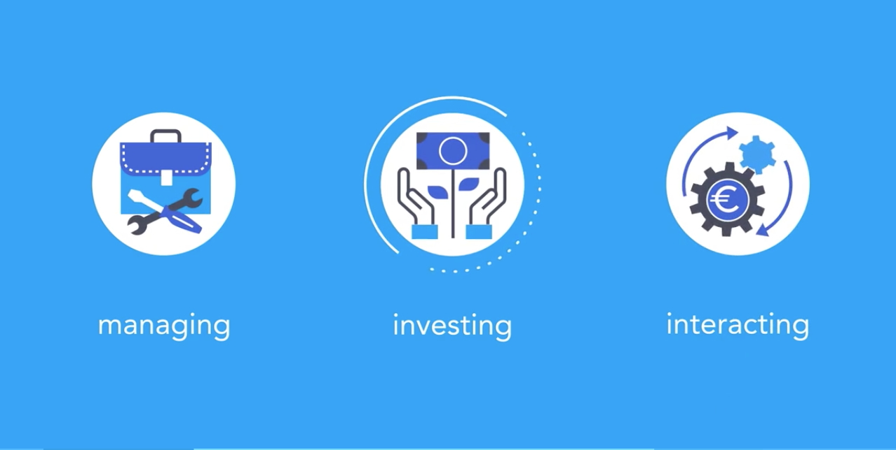

CoinDash-让每个人都能简单有效地在加密市场进行互动、管理和交易
=====

概述
-----
* 随着区块链行业的扩张以及加密资产在品种和价值方面的增加，加密资产的投资和投机市场也将随之增长。加密市场是无边界的、7天24小时全天候开放的，且受到最低限度的管制，并且提供了巨大的增长潜力。基于以上这些特性，加密市场对于传统市场的投资者们来说将是一个绝妙的新机遇。

* 目前，加密投资市场已经开始吸引新的投资者进入区块链领域。然而，投资加密资产的学习曲线非常陡峭，市场也缺乏精密有效的工具和信息化产品来鼓励新用户进入加密资产社区。

* CoinDash是加密资产的操作系统。目标是通过提供工具和服务来消除普通人进入加密投资的市场的障碍，使每个人都能简单有效地在加密市场进行互动、管理和交易。Coin大师将通过一个统一的平台根据主流用户的理念来设计其产品。

基本信息(数据截止2017/7/10)
----
* 发行日期：尚未发行（2017-7-17 21:00开启ICO）
* 市值排名：暂无
* 交易量前三大交易平台：暂无
* 官网：[https://www.coindash.io/](https://www.coindash.io/)

市场关注度(数据截止2017/7/10)
-----
* 推特：4715
* slack：3216
* 官网全球排名：231890

创立
-----
* 加密资产是2017年投资圈最火热的方向之一，在行业热潮的背后，Coin大师认为加密资产投资领域中依然存在一些痛点，包含：高昂的学习成本、专业投资工具的缺失、加密资产本身具备的高风险......

* 正是因为看到了这个机会与挑战，热衷加密资产交易的Adam Efrima和他的朋友们打造了Coin大师这个全新的投资平台，Coin大师具备投资组合管理、复制跟单、社区交流等功能，旨在为主流加密资产投资者提供卓越的投资平台。

项目进展
-----
* 7月9日举行北京线下见面会，上海见面会将在本周举行。

* 与CrytoCompare合作：CoinDash集成了CryptoCompare的API，以便我们的生态获取实时市场价格数据。还让CryptoCompare的用户可以直接从CryptoCompare.com网站访问高级资产组合管理工具。

* 与NEO区块链达成合作：在小蚁股品牌战略发布会（6月22日，北京）上，CoinDash的COO兼联合创始人Adam也进行了演讲，在这次会议上，小蚁股和CoinDash的合作关系取得重大进展。

* 与WINGS达成合作，本次合作将让CoinDash成为WING DAO上线后评估的第一个ICO项目。在ICO期间，CoinDash将利用 WINGS 社交奖励管理平台来最大化社区参与度和奖励报酬。

代币分配规则
-----
|比例|用于|
|:----:|:-----|
|50%|分发给参与ICO的投资者|
|29%|用于未来发展，用户收购、营销和公关|
|20%|早期投资者（10%）、核心团队（10%，6个月锁定）|
|1%|分配给社交赏金运动|

ICO详情
------
|项目名称：|CoinDash|代币代码：|CDT|
|-----|----|----|----|
|ICO开始时间：|2017/7/17|ICO上限：|1200万美元|
|代币总量：|10亿|ICO总量：|5亿|

项目分析
-----
* Coin大师代币：Coin大师平台的每个功能都能为用户提供财务价值，因此需要支付一定费用。每一个促进使用功能的用户又都会获得财务价值，并获得酬劳。这在系统中的用户之间创建了一个创建者 - 消费者关系；用户可以同时成为创建者和消费者。

* Coin大师将发布一种代币用于在平台上流通支付。 这使平台的成功与代币的价值直接挂钩。平台使用者越多，支付的费用就越多，因而就有更多的代币被购买 ——最终代币的价格也就越高。

 
* Coin大师提出了“Big Data based Decentralized Autonomous Fund”，即“基于大数据的去中心化自治基金”的概念，简称为DAF。应用“众智”筛选出真正具有价值的加密资产，用户通过设置不同参数可以创建出不同的去中心化自治基金。

* 众智（the wisdom of the crowd）的概念最早可以溯源到亚里士多德关于政治的论述，其原理是：综合群众的智慧，可以作出比某个专家更好的结论。现实生活中例子很多，如陪审团、维基百科的编制、《百万富翁》游戏中的询问观众等等。

* 通过Coin大师能够创建完全去中心化的基金，由于众多用户在Coin大师中创建并管理自己的投资组合，Coin大师便能够为社区成员提供绝佳的数据和见解。
  
* 通过统计相应代币在总成交量的占比，分析顶级投资者持有的代币种类，以及观察对应代币成交量的变化便足以获得许多重要的信息。例如：统计成交量前十的代币，把它们放在一只基金篮子里，当有一个新的代币成交量上升到前十时，Coin大师的这只去中心化自治基金将会自动变换。

* 用户还可以依据各种数据设置不同的参数，创建更多不同类型的基金，汇聚众多投资者的智慧，Coin大师的DAF将是世界上第一个完全中心化的自治基金。

* Coin大师还把“众智”应用在广受欢迎的ICO领域，旨在为区块链项目提供一个具有价值的预测系统，在Coin大师平台上用户模拟参加ICO项目或购买对应项目的代币，随着时间的推移，最优秀的投资者将获得奖励和声誉。用户参与模拟ICO投资盈利越多，越有可能获得Coin大师的代币奖励，这就鼓励大众去发掘优质的项目。而对项目方而言，通过这种方式，他也能够较好地得到关于自身项目的反馈，同时得到社区的关注。
 
* Coin大师是加密资产的操作系统，致力于使操作和交易加密资产变得更加简单、便捷。
 * Coin大师的生态系统包括三个相互联系的板块：
  1. 云服务平台:智能工具（如交互式投资组合）对于加密资产的管理至关重要。 Coin大师的分析能够让用户深入了解他们的投资成果，并帮助他们做出基于数据驱动的决策。
  2. 社交平台:社交互动是加密世界的关键部分，项目的沉浮决定于他们创建的社区和网络体系。Coin大师的社交交易功能可以让新老用户通过跟投或模仿顶尖投资者交易的方式来消除一些壁垒。跟投交易是基于信号交易功能的自动交易功能。用户可以将其持有代币的一部分用于跟投顶级投资者的交易。Coin大师平台和被跟投的投资者在此过程中不会触及其任何资金。
Coin大师平台上的跟投交易是完全分散的，由专门的智能合约系统管理。智能合约提升了安全性和透明度，使开发者能够增强功能并为用户提供模板。而资金控制权还是在用户自己手中的。
  3. 市场:Coin大师的市场是围绕发现机会和优化用户的交易体验而建立的，具有基于交易信号的实时社交、ICO仪表板、热门资产、实时市场价格表和第三方整合等功能版块。 
 

总结
------
* 融资上线1200万美元，估值较为合理；已于多方建立合作关系，进展明朗。

关于币种分析文章，请关注小密圈ID：61818889，小密圈将作为第一发布平台，也可添加微信 liqi_studio 进群交流。

