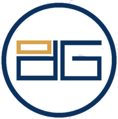
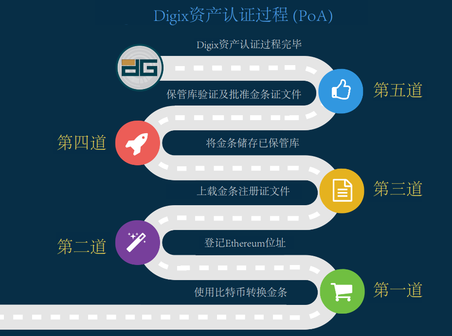
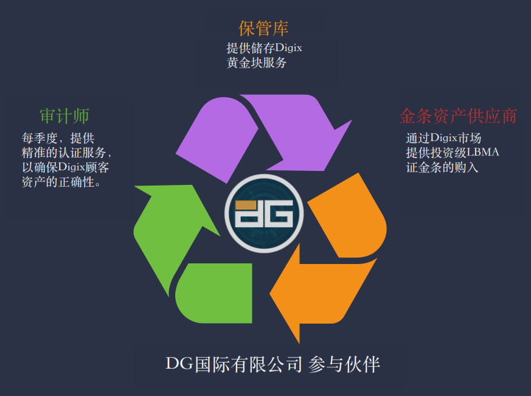

digixDAO(DGD)-建立与实物黄金锚定的稳定货币
=====

概述
-----
* DigixGlobal是由伦敦金银市场协会认证的以太坊资产平台，该平台的目标是在以太坊网络中创建一个新型的金本位数字支付系统。DGX俗称数字黄金，是Digix发布的基于以太坊的黄金代币，以100%黄金衡量，能用于兑换纯实的黄金。每个DGX代币代表1克由伦敦金银市场协会认证的黄金。DGD是一项基于以太坊的资产，代表DigixDAO的股权。DGD持有者将有权以投票的方式参与公司的决策，并且还会收到数字黄金DGX交易费中的一部分作为股权回报。

基本信息(数据截止2017/6/21)
----
* 发行日期：2016/4/18
* 市值排名：32
* 交易量前三大交易平台：云币网／Bittrex／Gatecoin
* 官网：[https://digix.io/](https://digix.io/)
* 区块链浏览器：[https://etherscan.io/token/dgd](https://etherscan.io/token/dgd)   

市场关注度(数据截止2017/6/21)
-----
* 推特：2789
* reddit：1025
* 官网全球排名：537910

创立
-----
* 董事长是TeoHye,Chng，新加坡人，曾担任富士通(亚洲)有限公司董事长。

核心团队（部分）
------
* CEO：KaiC.Chng曾在纽约华尔街一家国际投资银行工作四年，工作是外汇交易员。
* 市场总监 ：余俊杰（Shaun Djie）承办了Ethereum亚洲最大的交流活动。
* CTO：Anthony Eufemio，曾在Intel及NASA工作，在计算机安全与IT行业有18年的工作经验。
* 核心技术员：Chris Hitchott来自英国，曾担任Ethcore.io的设计工作。

项目分析
-----
* DigixDAO代币（DGD）：发行DGD代币以兑换加密电子货币。有了该DGD代币，有权为Digix上的项目建议书提供担保，担保重要程度与你以太坊账户DGD代币量直接成正比，且系统收集到的交易费将作为奖励送给你。

* 黄金资产所有权卡：发给金条购买者的数字黄金资产卡，列在DIGIX Web应用程序市场上。

* Digix黄金代币（DGX）：从系统黄金资产所有权卡中新生产的代币，指客户购买100克或1000克LBMA黄金铸模/锭装条。代币范围从0.0001克到1.000克不等，相当于按克计算的黄金现货价格。现在及将来，每一DGX代币都会通过物理金条在托管库进行备份。

* DGX是一种价格稳定的代币，因为它与黄金锚定的，其价格是通过金条的内在价值背书的。任何人只要有以太坊地址，就可以点对点地转移代币化的黄金。每一个DGX币的交易都会在区块链上留下一个资产证明，这个证明无法被篡改和摧毁。而且其所有权也是完全透明的。DGX币可以分解到小数点后4位。

* DGX币和市场上的其它黄金产品的区别：

 1. 可自由转移的资产。
 2. 可小量购买。
 3. 资产所有权全透明。

* 提案人徽章：提案人徽章是发给特定众筹参与者的，该参与者的购买数额需达到一定量——一万五千美元加密电子货币的数倍。有了提案人徽章，提议者可以正式提出他希望在以太坊上线的项目或功能。例如，它可以作为一个附加功能键、一个黄金可视化图表或附加产品。有了提案人徽章，也可以仔细审查其他提案人的项目。提案人徽章的重要程度与以太坊账户徽章量直接成正比。提案人徽章与担保不同。

* DGX币与DGD币的区别：DGX或者Digix黄金代币是基于以太坊的黄金代币，以100%黄金衡量，能用于兑换纯实的黄金。每个DGX代币代表1克由伦敦金银市场协会认证的黄金，而DGD币则是一种分红收益的币种。因为DGX币的交易会收取0.13%的手续费，这些手续费将会成为DGD币的分红来源。

* DGX币可被用来支付任何基于以太坊的产品和服务，而DGD代币持有者将收到在以太坊平台上的DGX交易费作为按比例分配的回报，同时也能为DigixDAO基金提供支持。

* DGX币是一种价格稳定的代币，因为它与黄金锚定的，其价格是通过金条的内在价值背书的。任何人只要有以太坊地址，就可以点对点地转移代币化的黄金了。每一个DGX币的交易都会在区块链上留下一个资产证明，这个证明无法被篡改和摧毁。而且其所有权也是完全透明的。DGX币可以分解到小数点后4位。

  

* DGD代币发行量：初期供应200万DigixDAO代币，其中170万代币在众筹中面向大众，30万代币面向Digix开发者。代币持有者的每1个代币都将会每季度按比例收到来自DGX交易费的1/2000000作为回报。并且也将会有一个自动的众筹项目建议书提交给现有的代币持有者，每两年为一轮，如果有81%的持币者同意增发，则会增加DGD供给。如果需要紧急资金，会提交一个建议书来增加特定数量代币的供应，这正是为了确保DigixDAO的持续性。除此之外，增发只有在大多数参与人同意后才会进行，因为这涉及到代币的稀释。现有的持有者将能够以一个特定的乘数在先于向大众发行前去购买更多的代币。

* Digix公司的产品是什么：Digix公司是一个将实物资产代币化的平台，会把资产所有权放上区块链，人人都可验证，也可以视为一个智能资产公司，产品完全基于以太坊区块链。通过以太坊区块链执行智能合约，交易也会通过全球节点得到确认。产品是一个数字化证书的软件。

* 假设在中国大陆的当地银行购买了100克黄金，怎么样把这个实物黄金变成DGX币？

* 首先要把实物黄金寄到新加坡，在收取一定的检测费用后，通过LBMA验证的99.99%成色的金条才可以进入到保险库。一旦金条通过验证，你就会收到黄金资产所有权的证书，这是网上的数字化证书。如果你愿意的话，这个证书可以转换为100.000枚DGX币。

* 如果在线上购买了100枚DGX币，可以在上海的Malcaamit金库取出100克实物黄金吗？

* 不可以，目前DGX币只能通过Malca-amit在新加坡的金库取出实物黄金。

* 有做过风险评估吗？对这个项目的前景怎么看？有失败的可能性吗？

* 代币叫DGD币，每季度分红，其利润来源于DGX币产生的交易手续费。同时DGD币的持有人也可以来提出扩大交易量的建议。比如说，某人可以提议说让某交易所上线DGX交易，但这个交易所需要收取一定的费用。这个时候基金会就可以支付这个费用，以便在交易所上线。项目的主要风险在于成本高昂，而且交易量能否稳定提升得不到保证。也会经常碰到合规合法的问题，当然团队会尽力做到符合监管。

* 如何确保1DGX=1克黄金？

* 黄金的供应商是新加坡上市公司方圆集团(Valuemax)，他们所出售的黄金都是经过伦敦金银协会(LBMA)认证合格的；提供审计服务的是成立于1828年的必维国际检验集团（Bureau Veritas Inspectorate），他们会定期对黄金进行独立审计。而Malca-amit则是一个国际性的保险库服务供应商，在全球主要城市都有保险库。他们的新加坡保险库靠近新加坡樟宜国际机场，位于新加坡自由港，面积达25，000平方米，高度安全和可空调控制温度的保险库，黄金在他们的保管下是相当安全的。

  

最新消息
------
* 2017年5月底Digix宣布向DGD持有者返还46.5万ETC，该笔ETC是在以太坊2016年进行硬分叉之后，使用众筹时筹集的46.5万个ETH匹配而得。鉴于有200万DGD币，所以每一个DGD币将会被返还大约0.23ETC。

总结
-----
* 交易费分红型代币，分红多少由DGX的需求和交易量而定。

* 流动性：DGD主要交易量集中在国内云币网（80%+），交易过于集中。

* 项目理念较为独特，与其它基于以太坊的项目差别较大。

* 代码持续更新，项目稳定推进。

**关于币种分析报告，请关注小密圈ID：61818889，小密圈将作为第一发布平台，也可添加微信 liqi_studio 进群交流,如需转载本圈文章，必须经得同意。**

