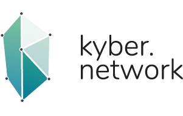
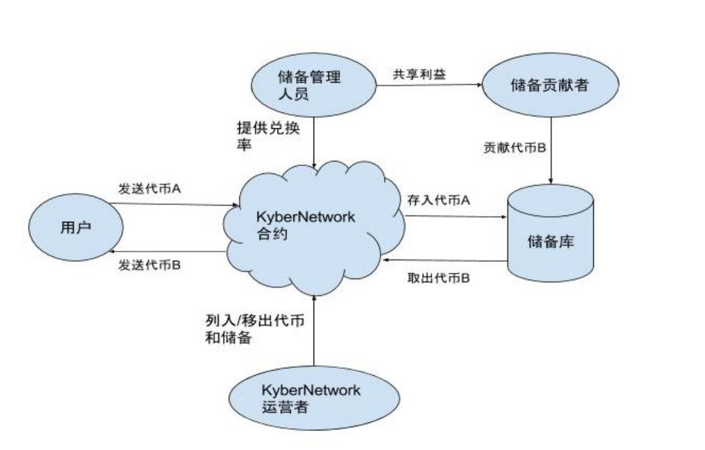
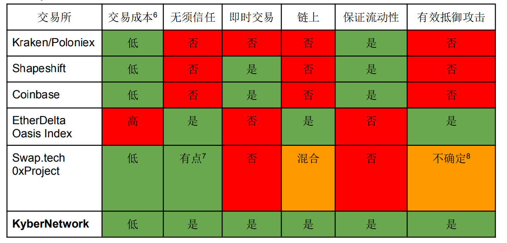
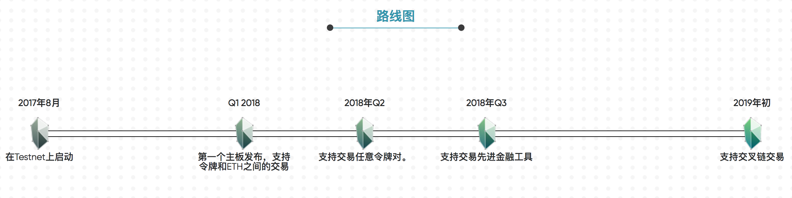

Kyber：无须信任的去中心化交易与支付服务
=====

概述
-----
* KyberNetwork是一个具备高流动性的数字资产以及加密数字货币即时交易和兑换的链上协议。将会是第一个实现交易所的理想操作属性的系统，比如无须信任特性、去中心化执行、即时交易和高流动性。除了行使交易所的功能，KyberNetwork还将提供各类支付API，以允许以太坊账户轻松地接收以各类加密代币形式呈现的付款。尽管是在以太坊网络上运行，但KyberNetwork的路线图包含了使用中继技术和类似于Polkadot 和 Cosmos 这样的未来协议，以支持不同加密币种之间的跨链交易。通过使用这种无须信任的支付服务，以太坊账户将能够通过我们的支付 API 安全地收到加密货币的付款。也将引入衍生工具来为用户降低 KyberNetwork Crystal（KNC）及其所选择的其他加密货币的波动风险。通过这种形式，用户可以综合参与价格走势。

代币基本信息(数据截止2017-7-14)
----
* 发行日期：尚未发行（预计9月中旬正式开启ICO）
* 市值排名：暂无
* 市价：暂未上市交易
* 交易量前三大交易平台：暂无
* 官网：[http://kyber.network/](http://kyber.network/)

市场关注度(数据截止2017-7-14)
-----
* 推特：522
* slack：388
* 官网全球排名：1295626

初始代币分配情况
-----
* 暂未公布代币分配详情。

众筹详情
------
* 暂未公布众筹详情

团队
-----
 

* Loi Luu：CEO、联合创始人，专注于加密货币、智能合约安全以及分布式共识算法的研究。还是比特币和以太坊研讨会（如DevCon2，EdCon，Scaling Bitcoin）的演讲常客。Loi 相信以太坊和区块链技术的力量，他大部分的工作都围绕着这个社区。他开发了Oyente，这是第一个基于以太坊智能合约的开源安全分析器。此后，他联合创办了另一个开源项目 SmartPool，该项目包含对现有加密货币矿池去中心化的研究。他从社区获得灵感，并创建了 KyberNetwork 项目，希望持续为区块链的去中心化及其无须信任的特点发挥热量，从而为社区带来更大的价值。

* Yaron Velner：CTO、联合创始人，SmartPool项目的研究员和联合创始人。他的研究重点是区块链协议中的博弈理论激励机制和智能合约的形式化验证。拥有特拉维夫大学计算机科学博士学位。博士论文研究了博弈理论技术在计算机程序和系统的形式化验证中的应用。Yaron 还是一位经验丰富的软件开发人员，拥有超过 10 年的高级软件工程师和担任EZchip semi-conductors（该公司被 Mellanox technologies 收购了）技术领导的经验。在 EZchip，他是数据结构和算法团队的成员，并参与开发了基于 IP 路由的新型数据结构。

顾问
------

* Vitalik Buterin：以太坊创始人和首席研究者。也是比特币杂志（Bitcoin Magazine）的创办者和攥稿人。他在 2011 年创办了该公司，由此开启了他在加密货币领域的职业生涯。他对于创建安全、高效、可靠的系统十分感兴趣，并为密码学领域中的多个项目提供咨询（此前V神在twitter公开表示，Kyber将是他最后一个担任顾问的项目）。

* Prateek Saxena：新加坡国立大学计算机科学研究教授，从事区块链和计算机安全研究。他的研究影响了今天广泛使用的浏览器平台、网络标准和应用商店的设计。多次荣获包括麻省理工学院 TR35 Asia在内的多项首要奖项。

项目分析
-----
下图是KyberNetwork中每一个活动者间的交互过程：

* 无须信任与安全性：KyberNetwork 运营者不持有用户的代币。因此，在设计模式中，用户无须担心承受代币被平台盗窃损失的风险。由于智能合约强制/保证了运营者的诚实性，因此用户不需要相信储备实体和 KNC 代币持有者的意图。

* 即时交易：在单个交易中某一交易或兑换的请求会立即被执行。用户在转出自有原始代币的那一瞬间即可获取他们所要兑换的代币，无需保证金、无需确认，也无需等待时间。这种高效和用户友好型的功能将使KyberNetwork 在现有和未来的交易所中脱颖而出。

* 链上交易：交易在链上进行，适用于所有账户，包括普通账户和智能合约。这种方式使得智能合约可直接与交易所进行交互，无需第三方干预，并达到以原生不支持的各类代币的形式来进行接收/支付业务的目的。此功能使KyberNetwork 可以成为适用于所有帐户的代理支付平台，包括普通账户和智能合约。

* 兼容性：KyberNetwork 的运行不需要对以太坊的基础协议和现有的智能合约进行任何修改。支付 API 可以与现有合约进行通信，而不会对其进行任何更改。还推出了一个新的合约钱包，该钱包持有所有用户的以太币和其它代币。这个钱包允许用户把代币A支付给期望收取代币B的合约。其中，从A到B的兑换由KyberNetwork 无缝完成。接收方收到付款时就像该款项是从原始发送方发送的一样。

* KyberNetwork 与现有系统的对比如表格所示：

发展路线
-----
  

|阶段|完成时间|进展|详细|
|----|----|----|----|
|0|2017年8月|测试网部署|开发MVP版本，包括KyberNetwork钱包，主要的合约和储备信息面板。目的是要创建一个具备所有主要功能和应用的 KyberNetwork 的基本功能版本。MVP将公开发布，相关合约将在以太坊测试网上进行部署和测试|
|1|2018年一季度|基础主网部署|在主网上部署第一个版本的KyberNetwork。先开发支持任意代币与以太币之间进行交易和代理支付的功能。还将与 MyEtherWallet，Status，Jaxx 等电子钱包提供商合作，实现 KyberNetwork的核心功能|
|2| 2018年第二季度|支持任意代币对|在阶段1顺利实施以后，这个阶段的目标很容易就能够实现。预计有更多的储备（即做市商）加入KyberNetwork。还将构建API，以允许其他平台中的用户以各自期望的代币的形式高效地赎回代币/共享费用。这些平台中的代币持有人就可以通过KyberNetwork无缝地获得符合各自需求代币形式的共享费用，比如 ETH|
|3|2018年第四季度|支持高级金融工具交易|计划与去中心化的对冲基金平台（比如，由 Melonport提供的平台）进行合作。人们可以对符合无须信任特性的对冲基金进行投资，并从高效的基金管理中获得利润。与项目的创始人、顾问提供归属计划的ICO项目合作也是重要目标|
|4|2018年末/2019年初|支持跨链交易|将允许用户实现以太币/其他代币与比特币、ZCash 和 ETC 等代币之间的交易。有两种方法来实现此目标：使用链中继技术（例如 BTCRelay 和 ZecRelay）或使用跨链通信协议（例如 Cosmos，Polkadot）|

关注要点
-----
* 以太坊链上交易处理速度是否能满足去中心化交易所的交易频率。
* 跨链交易在技术上是否能够实现。
* 引进的做市商制度，能否满足即时成交。
* 从长远来看，去中心化交易所确实能够解决中心化交易所的很多问题（资金安全问题，法律问题等），是行业发展趋势。
* V神公开确认的最后一个担任顾问的项目，引起市场的广泛关注。
* ICO详情官方尚未公布，需继续关注。

关于币种分析文章，请关注小密圈ID：61818889，小密圈将作为第一发布平台，也可添加微信 liqi_studio 进群交流。

