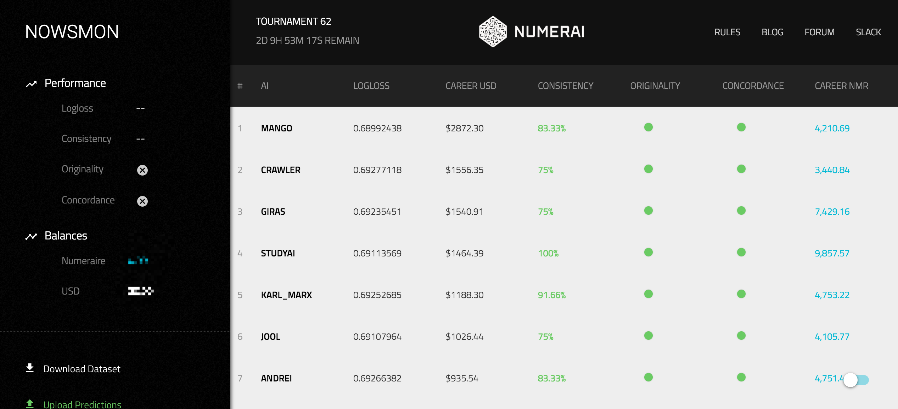
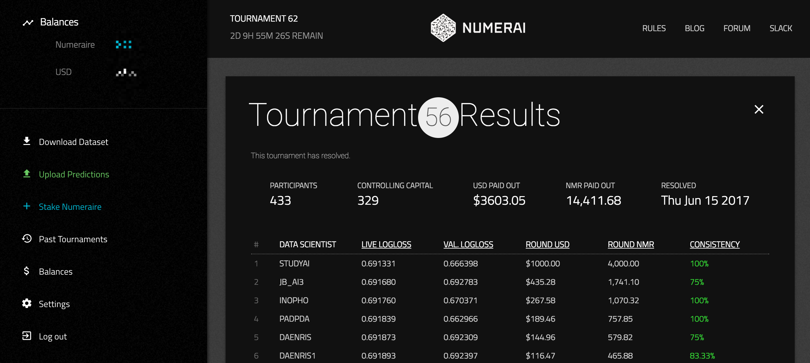
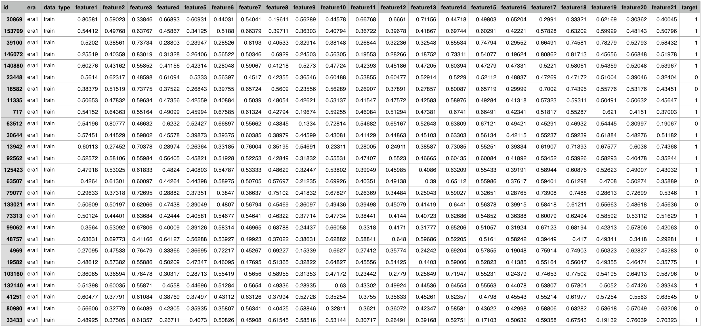

Numer.ai——发行代币但不融资，基于数据科学家和机器学习的对冲基金
=====

概述
-----
* Numerai是一家使用AI技术的对冲基金金融技术公司，基于建模用户与数据双匿名的方式，将加密数据开放给用户，以用户贡献的众多的模型综合去搭建人工智能模型，后期进行建模与分析，使用人工智能达到投资效果。

代币基本信息(数据截止2017/7/3)
----
* 发行日期：2017-6-23
* 市值排名：57
* 交易量前三大交易平台：Bittrex
* 官网：[https://numer.ai/](https://numer.ai/)
* 区块链浏览器：[https://etherscan.io/token/0x1776e1F26f98b1A5dF9cD347953a26dd3Cb46671](https://etherscan.io/token/0x1776e1F26f98b1A5dF9cD347953a26dd3Cb46671)   

市场关注度(数据截止2017/7/3)
-----
* 推特：6320
* github：144
* slack：4589
* 官网全球排名：151854

创立
-----
* 在计算机科学尤其是人工智能领域，开源是普遍的共识。Github上活跃着世界各地成千上万的程序员，每天都有如Google、Facebook或者个人开源出新的项目和新的数据。开源让信息彻底开放流通，带来的是共享精神和人类技术飞速的发展。

* 然而在金融领域，情况却截然相反。数据是封闭的，有价值的数据流都论斤按两贴上昂贵的价签。能赚钱的机会更是被各个基金死死藏在手里，不会向外界分享半点。这是一个囚徒困境，是靠信息不对称来对赌赚钱的世界。

* 2015年10月，名叫 Richard Craib 的1987年出生的南非小伙子想改变金融领域的黑暗森林法则。Craib曾供职于一家南非的金融公司，为这家金融公司搭建机器学习算法去操作基金，但是模型相对简单。就在他希望能够共享公司数据，使用他的朋友更加先进的、基于神经网络的模型时，出于数据保护和商业机密的考量，他被禁止做数据共享。从那时开始，他开始考虑如何让公司数据得到保密的同时，让更多数据得以共享并建设更多的AI模型做测试。
* Craib相信这种基于纯粹数据的双盲互动可以建立更有效的分析模型。于是 Craib 辞职自己创立了 Numerai。经过一年的股市交易，Craib表示通目前Numerai的模型是可以有效地获得收益的。

项目进展
-----
* Numerai 在6月21日宣布已经发行了120万个“numeraire”代币（NMR），这些数字货币已经开始分配到19000个数据科学家参与的分布式网络中，这些数据科学家帮助改进了用于在股票市场上实际下注的计算（由于不存在融资活动，该代币没有早期投资者）。

* 2017-6-23 代币 NMR 上线 Bittrex 开始二级市场交易。

项目分析
-----
* 在AI被应用在股票投资领域之前，程序化交易是三十年来被广泛引用的交易策略，利用现有模型让计算机进行高频交易已经非常常见。程序化交易按照既定的算法进行操作，无法根据实时发生的市场变动调整算法，这就导致程序化交易操作下的市场可能因为黑天鹅的出现而发生事故。而人工智能理论上可以将更广泛、更复杂的因素纳入走势预测的考核，如货币政策、突发的自然事故乃至企业的管理层变动等。

* 人工智能在交易投资方面的应用仍然处于实验性的阶段。

* Numerai建立人工智能的方式比较特别——基于建模用户与数据双匿名的方式，将加密数据开放给用户，以用户贡献的众多的模型综合去搭建人工智能模型。
 * Numerai每周定期发布加密数据和建模比赛，招揽匿名的用户用加密过的交易数据集进行建模和分析。Numerai将数据处理成更为纯粹和抽象的形式，人们不必知道这些数据背后真正发生了什么交易，仅仅运用这些数据建立机器学习模型。因为用的是加密数据，这些数据无法被应用在其他现有的机器学习模型中，而且企业信息可以得到更好的保护，这种保护让更多的交易数据集得到释放和共享。任何人都可以通过匿名的方式参与Numerai的训练营，如果参与者的模型真的成功地预测了市场，他们将获得奖励。每周将会有100名参与者因成功的预测了市场收到奖励。

 * 对数据进行同态加密之后最大的问题在于需要耗费大量的运算时间，这将显著降低数据分析任务的运转。**所谓同态加密，是指在对数据加密的同时，保留对数据运算处理的能力。A对数据加密后，B可以对加密数据进行运算处理，但看不到数据原始的样子；处理后的结果经过A解密后，得到的正是运算处理之后的结果。**这就好比为了防止加工金子的工人偷窃金子，为工人配备一个锁着的盒子与手套。
 
 * Numerai通过堆积或装配（ stacking or ensembling）的统计和机器学习技术对搜集来的有效模型进行整合，使之成为最有效的整体。对于Numerai而言，用户是匿名的，他们鼓励更多来自不同领域的人参与到模型建设中，不过用户无法得知Numerai将他们做出的模型进行怎样具体的整合。

* 关于代币Numeraire（NMR）：

 * 团队发现很少有数据科学家会去向同行介绍和推荐numerai，因为没有人想要更多的竞争者和自己竞争分钱，更不要说相互之间的协作。于是基于区块链技术，Numerai自己发行了一套货币：Numeraire.

 * Numeraire 会以数据科学家在榜单上的排名为比例发放。一个人模型表现得好，除去得到奖金之外，还会得到更多 Numeraire；如果模型表现的差，已有的一部分 Numeraire 将被销毁。**NMR代币不会在ICO中出售。只能通过在 Numerai 的数据科学比赛中竞争获得。**最关键的是，整体的Numeraire 的价值会随着基金的价值升高而增加；基金赚的钱越多，拥有Numeraire 的人们分红也将越多。这事实上是在奖励合作，让数据科学家们号召更多的同行参与进来，一起建立优秀模型，提高整体基金的价值，也提高自己手中 Numeraire 的价值。
* **当数据科学家想要锁定一个预测时，他们可以将numeraire发送到一个智能合约上，然后直到所提交的预测有了结果，资金会一直保存在智能合约上。那些预测准确的人将获得奖励，其numeraire被返还，而预测不准的人的numeraire将被销毁。**
* numerai界面如下：
  
   
* 经过加密后的数据：
   

关于项目分析文章，请关注小密圈ID：61818889，小密圈将作为第一发布平台，可添加微信 liqi_studio 进群交流。

