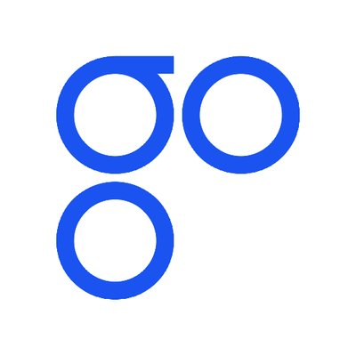

OmiseGO(OMG)-去中心化交易和支付平台
=====

概述
-----
* OmiseGo正在搭建一个具备去中心化交易、流动性提供机制、清算信息网络和资产支持的区块链网络。OmiseGo通过启动公有链上的去中心化交易所，提供大批量且低成本的下一代价值转移服务，支持多种货币和资产类别。通过与Ethereum主网连接的OmiseGO网络，任何人都可以以完全去中心化和廉价的方式，进行付款、汇款、工资存款、B2B业务、供应链融资、忠诚度计划、资产管理和交易等其他服务等金融交易。此外，世界上最大增长经济体的数百万主流用户将能够从使用法币转向使用去中心化货币如ETH、BTC等。OmiseGO网络在法币和去中心化货币之间本质上是不可知的：就采用和使用而言，系统的构建方式可以让最好的货币脱颖而出。

基本信息(数据截止2017/6/19)
----
* 发行日期：尚未发行
* 市值排名：暂无
* 交易量前三大交易平台：暂无
* 官网：[https://omg.omise.co/](https://omg.omise.co/)

市场关注度(数据截止2017/6/19)
-----
* 推特：4650
* github：16
* reddit：166
* slack：2012
* 官网全球排名：127159

创立
-----
* Omise成立于2013年，是一家由风投资金支持的支付公司，业务涵盖泰国、日本、新加坡以及印度尼西亚等地，现迅速扩张到亚太地区的邻国。Omise的愿景是“人人皆可在线支付”。

* 2016年11月，Omise作为金融科技明星（Fintech Rock Star）登上了福布斯（Forbes）。据介绍，Omise成功的秘诀在于公司只专注于以简单，集成和安全的方式来理解与满足实际业务的需求。在短时间内，Omise已经帮助超过8000家商家发展数字货币及银行卡处理服务。

* Omise的支付网关业务已经拥有美国运通以及银联的直接会员资格，也是泰国第一个已经获得PCI DSS安全合规性认证的云端支付网关。

* Omise一直是以太坊的铁杆粉。2015年，Omise向以太坊资助了10万美元以重启由以太坊基金会运营的开源资助计划（DEVGRANTS）来支持项目开发。据说当时除了Omise以外，支持以太坊的企业只有微软和万向集团。

* 2017年，Omise的区块链部门OmiseGO正式成立。它的使命就是使用区块链技术通过建立一个易访问且具备包容性的金融科技平台，实现实时交易及支付服务。通过OmiseGO，不同国家、地区、贫富差异以及社会阶层的用户都可以直接在平台上开展交易。此外，Omise GO还是一个全方位连接的平台。这意味着，对于不同电子钱包和金融服务之间的应用层面以及区块链层面，OmiseGO都满足互操作性。

项目进展
-----
* 团队目前忙于研究POS、网络的可扩展性以及建立伙伴关系。ICO 结束后的首要任务是扩大开发团队及伙伴关系以及发布新产品。目标是在2018年底之前部署OMGchain网络
* 6月14日，以太坊创始人Vitalik在推特上发布：以后将不会担任任何ICO项目的顾问，目前仅担任OmiseGO和Kyber的项目顾问。
* 6月27日正式开启ICO。

投资人
------
* 2016年，Omise完成B轮融资。参与融资的机构包括Golden Gates创投，SBI投资，SMDV以及ASCEND资本等众多知名风险投资公司。

代币分配规则
-----

|比例|用于|描述|
|:----:|:-----|:-----|
|65.1%|ICO|分发给参与ICO的投资者|
|5%|Airdrop共享|与ETH利益相关者共享，作为与主网产生关系的激励方式，将在ICO结束后进行|
|20%|OmiseGO项目自留|作为支付项目开发和执行的部分费用，锁定期一年|
|9.9%|团队自留|团队成员和早期投资者预留，锁定期一年|

项目分析
-----
* OmiseGO代币：Omise将提供OMG（OmiseGO）代币的销售，允许代币持有者在验证某种特别的权益证明（POS）网络上的交易时，赚取相应的费用：这是一个内置于区块链的去中心化的交易所，其共识规则可以与大多数其它区块链进行深度互操作，包括以太坊和比特币，同时也是一种提供网络经济安全的新颖方式。

* miseGO区块链和OmiseGo白标钱包SDK：
 
 * OmiseGO区块链由去中心化交易所、流动性提供者机制、清算行通信网络和资产支持的区块链网络组成，它是一课可扩展完全公开（非许可型）区块链，其权益证明共识由链本身的活动担保。该网络是一种利用相互连接的区块链构造的高性能系统：在OmiseGo区块链中进行清算和结算时，保护交易价值的成本以直接促进这些链的价值的方式外在于其它链。

 
 * OmiseGO白标签钱包SDK将允许多种支付解决方案轻松部署在强大的OmiseGO网络上。数字钱包提供商可以灵活地为各种行业和垂直市场增强、添加并定制支付解决方案。数字钱包供应商的所

* 去中心化交易和 etherdelta的区别：区别在于实施方法不同。Etherdelta是基于以太坊的应用，而去中心化的交易直接建立在共识层上，并且因为许多原因与以太坊相关联， 其中一个原因就是经济安全（ 以太坊哈希算力）。

ICO详情
------
|项目名称：|OmiseGo|代币代码：|OMG|
|-----|----|----|----|
|ICO开始时间：|2017/6/27|ICO上限：|1900万美元|
|接受币种：|ETH|兑换比例：|1ETH=1000 OMG|
|代投平台：|未知|ICO下限：|800万美元|
|代币总量：|未知|ICO总量：|未知|

总结
------
**1. 以太坊创始人Vitalik担任项目顾问，团队阵容强大。**

**2. 市场关注度高。**

**3. 65.1%的代币融资1900万美元，整体估值约2919万美元，估值较低，有较大升值空间。**

**4. 公司成立已4年，发展路线清晰。**

关于币种分析文章，请关注小密圈ID：61818889，小密圈将作为第一发布平台，也可添加微信 liqi_studio 进群交流。

