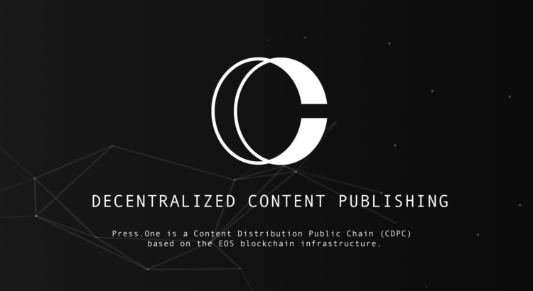
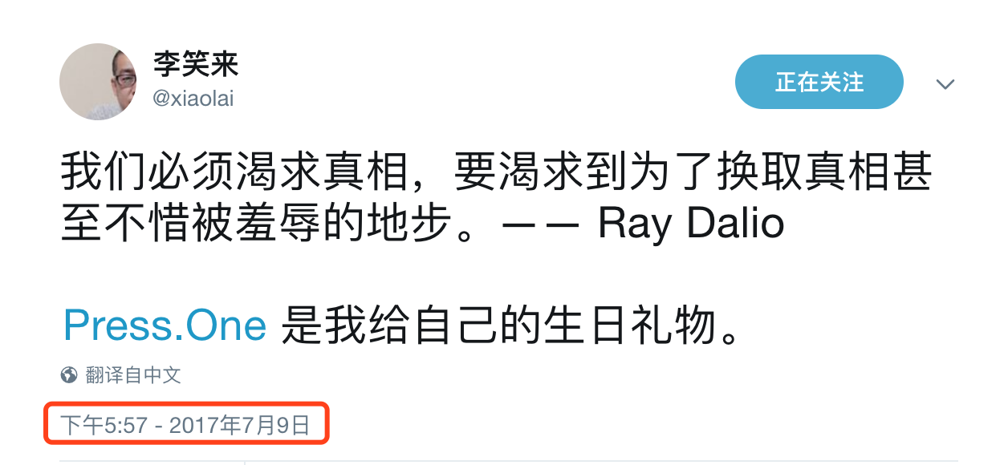
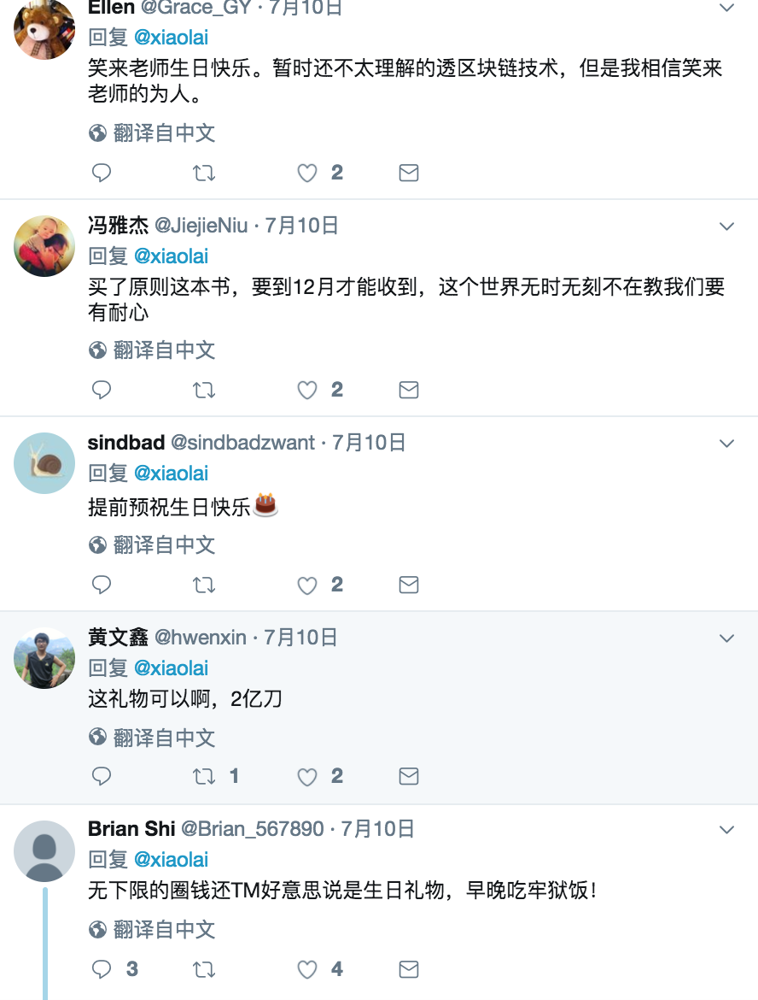
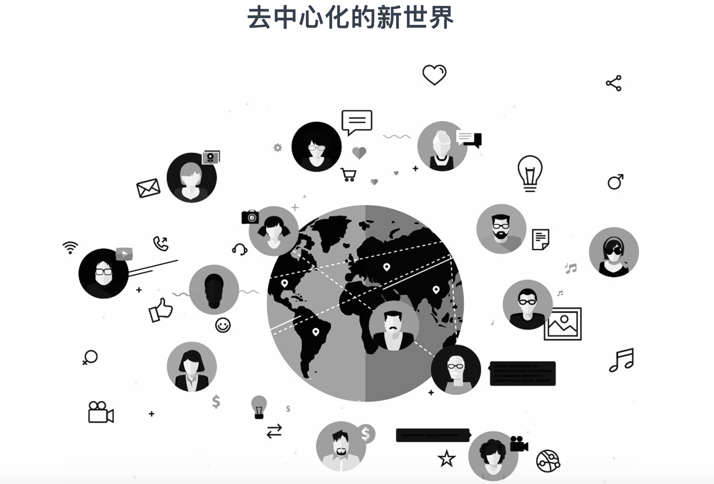
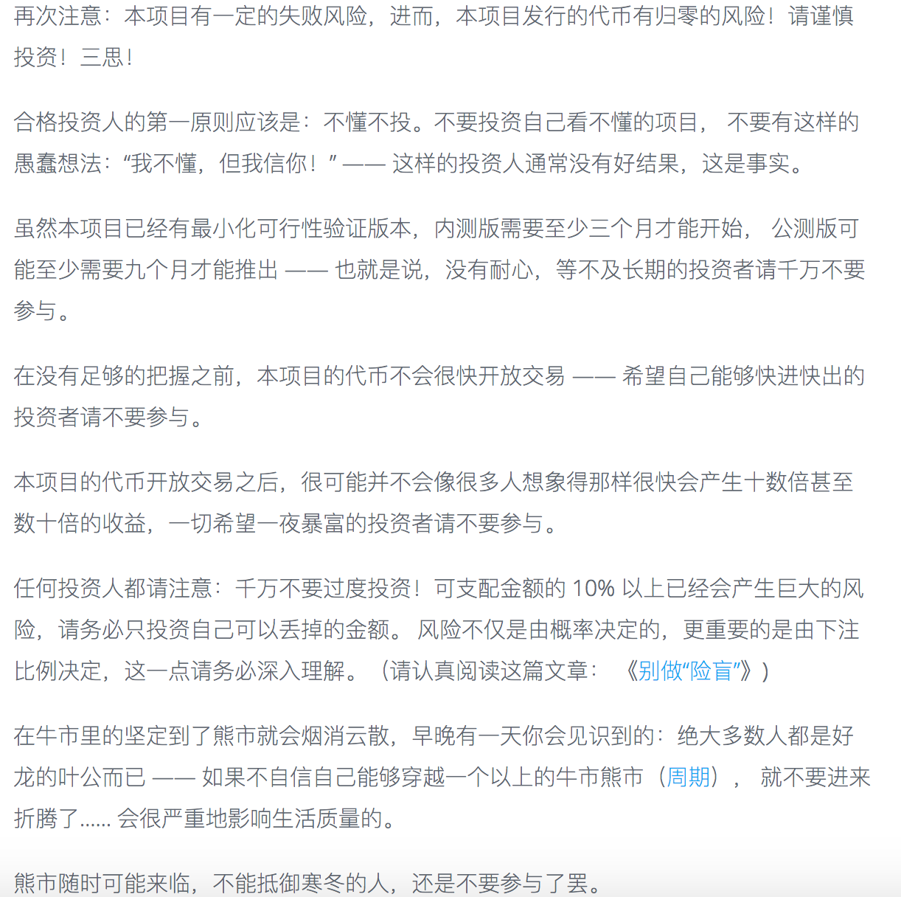

来，客观的了解一下李笑来的PressOne
=====

 
 
 * 李笑来在pressone众筹前发布于twitter

* 李老师在twitter的关注量最近增加了非常多，目前已有8.68万人关注。
* 新浪微博关注量达17.9万（目前已关闭评论功能，有话想和李老师说的可以去twitter留言）
* pressone官网全球排名第267091（算是比较靠前的排名了）

 
 李老师生日快乐
 
初始代币分配情况
-----
* 代币总量210亿枚PRS。

 |比例|数量|用途|
|----|----|----|
|47.62%|100亿|分配给众筹期的参与者|
|4.76%|10亿|用于奖励性分发，奖励细则由项目创始团队另行发布|
|19.05%|40亿|用于投资（或换取）PressOne上项目的代币，所有被投资团队持币锁定期至少一年；确认的投资收益将以分红的方式发放给所有PRS 持有者|
|28.57%|60亿|用于项目维护。其中5亿个PRS用于团队建设，每半年解锁 2000万个；余下55亿枚无限期锁定，只能在必要时以社群共识之指定价格公开发售（不得低于此次公开发售平均价格的五倍）|

众筹详情
------
|项目名称|PressOne|代币代码|PRS|
|----|----|----|----|
|ICO开始时间|2017-7-12 22:00|融资目标|2亿美元|
|ICO结束时间|2017-7-15 22:00|接受币种|BTC ETH EOS|

* PRS 完成分配需要半年左右
* PRS 可转账交易时间暂定为 2018 年 7 月 12 日
*  ##PressOne 决定提前一天（7月15日晚上10点）结束代币销售， 未售完部分，全部按照比例分发给结束之前的购买者。##

基于以上细节，我们可以得出：
-----
 1. 发售的代币PRS，总量210亿个，对外发售100亿个。如果把PRS看作股权，则48%不到的股权是出售给投资者的。
 2. 不发售的代币中，有55亿个是被无限期锁定的(占26%)。只能在必要时以社群共识之指定价格公开发售，不低于本次公开发售平均价格的5倍（言下之意就是你手上的PRS在那个时候至少可以以5倍发售价出售——前提是PressOne这个项目没有失败）。看起来PressOne对于PRS的增长还是有信心的。
 3. 本次的融资目标为2亿美元。按照发售的100亿个PRS来计，单个PRS售价为0.02美元，约0.13人民币。
 4. 100亿个PRS占2亿美元，那210亿个PRS是4.2亿美元市值。这个市值在目前的全球加密货币里排名约为第10位。
 5. PRS限定了参与ICO投资的代币：50亿枚PRS来自于EOS，相当于1亿美元。EOS目前市值4亿不到，要吸接近25%左右的EOS代币，比例相当高，当然EOS的代币还在逐渐发行，占比会越来越小。对于ETH和BTC的吸收就微不足道了。
 6. 预计一年后开放交易。PressOne声称已有最小化可行性验证版本，至少三个月后内测，九个月后公测。这两次测试情况，差不多就能决定着PRS可交易后的初始价格。

项目分析
-----

pressone要做的事情

pressone的风险提示，建议一定要仔细阅读

* 已再三告诫投资者：不懂不投。没有耐心，不能长期持有的别投。想一夜暴富的别投。下注比例别太高。

所以我准备好好了解一下pressone项目，然而：

>PressOne 正式上线之前并不提供所谓的"白皮书"——那个通常即便是提供了也没多少人看得懂，甚至就没几个人看的东西。

are you kidding me？

关于币种分析文章，请关注小密圈ID：61818889，小密圈将作为第一发布平台，也可添加微信 liqi_studio 进群交流。

