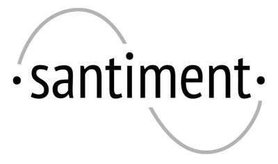
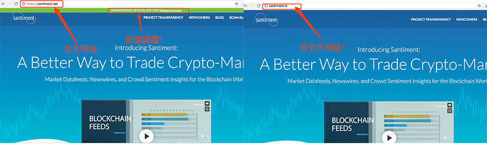
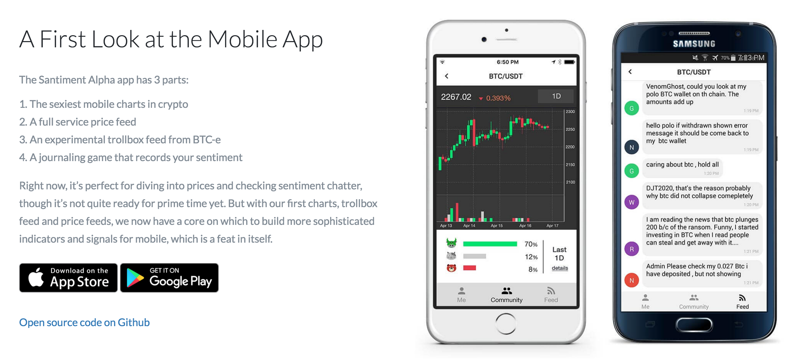

Santiment—实时收集市场数据，旨在成为加密市场的数据源平台
=====

概述
-----
* Santiment旨在成为加密货币投资领域的彭博机。Santiment提供的大众情绪平台可以为用户提供“独家的情绪数据”,旨在收集实时市场数据，然后售卖给加密货币投资人。Maksim Balashevich（Santiment创始人）在2017年1月5日预测山寨币的市值将会暴涨。

代币基本信息(数据截止2017/7/5)
----
* 上市日期：尚未上市交易
* 市值排名：暂无
* 交易量前三大交易平台：暂无
* 官网：[https://santiment.net/](https://santiment.net/)   
**（注：santiment.io 为诈骗网站，santiment官方已发布公告，请投资者注意分辨。）**

  

市场关注度(数据截止2017/7/5)
-----
* 推特：798
* slack：已暂时关闭，众筹结束后将重新开放
* 官网全球排名：359531

众筹情况
-----
* 第一阶段：2017/7/4 只向Santiment社区白名单用户开放（开始区块#3973420）。

* 第二阶段：2017/7/5 只向拥有Cofound.it优先通行证的用户开放
（开始区块#3978496）。
* 第三阶段：2017/7/6 向公众开放（开始区块#3983578）。
* 1ETH=1000SAN，硬顶4.5万ETH，只支持Myetherwallet、Parity、Mist、Ledger Nao钱包参与众筹，众筹结束7天后发放代币。

代币分配比例
--------
|比例|用途|
|----|-----|
|18%|团队预留|
|4%|顾问及合作伙伴|
|6%|用户奖励池|
|18%|早期支持者|
|54%|ICO分配|

项目分析
-----
* Santiment网络旨在通过机器学习和群体智慧，帮助其用户（投资者和交易人）获得一种无法在其他地方获得的“信息优势”。

* 大众的情绪：Santiment的大众情绪平台称，可以为用户提供“独家的情绪数据”。这种理论和数据应当使加密货币的交易更快捷，更有利可图。

* Santiment还支持用户在“加密货币金融”游戏中赚取Santiment网络代币，或者在“独家市场”花出这些代币。

* 通过使用Santiment，可以获得清楚的市场分析报告和交易数据图表、使用带有可视化和比较情绪数据功能的“伙伴”。这个伙伴可以将用户的“劣势转化为优势”，从而在“战役测试” 模拟器中获益。

* 内容流：目标是尽可能客观的提供一些关键问题的答案，使得加密市场更加透明、安全、专业，欺骗者将被集体分析，暴露出来并广播出来。

* 数据库：目标是建立经过分析师验证的高品质加密市场信息。
* Santiment已与 Cofound.it 达成战略合作伙伴。
* Alpha版本移动端已上线（下图）。

  

总结：
-------
1. 市场关注度较低，国内无推广。
2. 融资上限较低。
3. Alpha版本已发布，进度明确。

**关于项目分析文章，请关注小密圈ID：61818889，小密圈将作为第一发布平台，可添加微信 liqi_studio 进群交流。**

