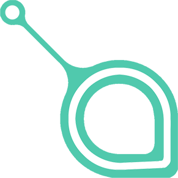

云储币(SC)-sia如何让云储存去中心化及项目进展
=====

基本信息
----
* 发行日期：2015-06-7
* 共识机制：pow
* 近7天涨幅：257%
* 市值排名：19
* 交易量排名：最近1天第11，最近7天第10，最近1月第14
* 交易量前三大交易平台：p网／云币／b网
* 官网：http://sia.tech/

市场关注度
-----
* 推特：6621
* slack：2938
* github：730
* reddit：3062

团队
-----
* David Vorick大卫·沃里克：联合创始人，Sia Core的首席开发人员；11岁开始编程（那时候大多是html和javascript）。在13岁的时候，开始用php建立数据库网站。最后学习Java和C语言，并去了伦斯勒理工学院获得计算机科学学士学位。2014年初，开始从事Sia开发。

投资人
-----
* 投资者包括 Procyon Ventures，Raptor Group，分布式资本和天使投资人李笑来。

项目进展
-----
* 最进更新：用户版／开发人员版／旷工版均于2017/5/22，更新至1.2.2版本，该版本主要更新：将RAM使用量减少500MB;即时钱包解锁；修复windows主机偶尔丢失所有数据和合同的错误；GUI将支持钱包的用户设置密码，而不是要求用户每次提供种子；钱包中的种子恢复代码不需要重新启动才能找到余额；消除在windows上运行主机作为管理员(在linux／mac上已经不需要)；将种子加载到钱包中的图形支持；轻微增加下载速度；修正主机自动发布错误，主机即使设置正确也会频繁发布；提高主机的访问速度，延迟和吞吐量瓶颈-提高总体可扩展性。

* 下一版本：将于2017年6月发布，主要更新：能够在没有本地文件的情况下修复文件；简单的文件共享-于其他sia用户共享文件；初始块链同步时间减少；启动时无需用户干预即可启动钱包解锁；支持部分下载-只下载文件片段，并以任何用户选择的顺序下载片段；租客开始修改／更换低质量的主机-导致更可靠的文件，并以更快的速度；能够从执行者目录的过时备份中恢复文件。

* 未来6个月：适当支持微型文件(将最小文件大小从40MB减小到100kb)；视频流；能够设置价格与性能偏好，包括黑名单或白名单主机的功能；持续的错误修复，测试升级和整体稳定性改进；表单文件合约5分钟而不是60分钟；支持租户一次>10tb的文件；自动主机定价；向主机添加烧毁证明机制(poB)，能够看到主机正常运行时间。

* 未来2年：文件共享-与不在sia的用户共享文件，只能使用您的钱包种子恢复文件的能力；支持移动钱包和其他客户端；基础种子文件恢复

实现原理
-----
* Sia最初的设计目的是：让云储存去中心化。当前，大多数数据由一个中心托管。一个单一的企业掌握着所有的数据，而且数据常常是不加密的。当前，把数据放在云中需要信任。你得相信托管中心会保存你的数据并尊重你的隐私权。Sia准备建立一套完全不同的系统来把数据放在云中。

* 使用Sia时，数据被存在多个存储供应者（托管主机–译者注）的主机里。Sia的设置是可以调整的，但系统的标准设置是把一个文件存在30个托管主机里。一种称为Reed-Solomn算法使我们可以把一个文件分成多个部分并把个部分分别存于各个托管主机里，这样一来，只要10个托管主机就足够恢复一个文件。这个10对30的方案意味着文件会有三个备份。如果有95%的在线率，这个10对30搭配所提供的文件在线率将达到99.999999999%。在这个计算里，考虑到托管主机会各自出现故障，但是小心的按地区挑选托管主机应该会给你合理的独立性。如果托管主机有98%的在线率（每天允许有30分钟的下线时间，或每月15个小时的下线时间）只需18对30的搭配文件就能达到99.999999999%的在线率，即1.66倍的备份，这将可以节省非常可观的成本，能更好地抗拒攻击和破坏，而且能提供更大的托管主机群以利于高度的平行下载。

* 每一个托管主机都受到加密文件合约的约束。当一个文件上载时，同时形成的合约将确保托管主机只有在完成了在预定的时间段里保管文件的条件后才能拿到支付款。托管主机也需要提交一定的押金，如果一个托管主机没有完成合约，它不仅得不到支付款，而且还会失去押金。文件上传时，上传者清楚这个系统有很强的抗虚假托管主机，以及这些虚假托管主机会受到很大的金钱惩罚。区块链使这种合约成为可能。

* 最开始的Sia设计针对安全性，隐私权，和数据的完整性。然而在建立这个网络的过程中，我们也建立了一个市场。Sia是一个开放的市场，在这里任何托管主机都可以参加，而且纯粹以商业信誉来论好坏。一个托管主机的等级将取决于它的速度，价格，和可靠性。托管主机将无需考虑客户服务，品牌建立，或法律条约等成本花费，托管主机只需在一个层面竞争: 在技术上更好。其结果将是一个高度竞争的，价格不断趋于下降的，更加可靠的，和不断提速的网络。Sia的目标不仅仅是最安全的云储存平台，而且还是最快的和最便宜的平台。在早期，我们看到了Sia的价格只在传统云储存平台的10%和20%之间。

* Sia是提供数据远程存储的网络。通常这种网络被称为‘云储存’，其核心功能是你可以先把数据放在网络中，然后你可以在世界任何地方取这些数据。把数据放到一个网络中意味着其他的人(托管主机)将保存你的数据，而且负责在你需要时归还这些数据给你。Sia对网络做了一些关键的假设:
  * 托管主机不可信任---如果可能的话，他们会偷看，偷窃，和舞弊。必须使用强有力的机制来阻止和防止这些恶意行为。
  * 托管主机不是慈善机构---托管主机需要报酬，特别有私人数据或大量的数据的时候。而且一定要保证能拿到报酬。
  * 托管主机是不稳定的---一个单一的托管主机，甚至一群托管主机，可能会离线和下线，即使过去它们有100%的在线率。
  * 网络是不友好的---如果网络有漏洞，一定会有人发现并利用这些漏洞谋私利。
* Sia能够在有如上这些特点的网络中安全地存储数据。Sia应用了三个核心策略来确保数据的安全。
  * 首先是加密，其目的是在托管主机试图窥探数据时能保护数据的隐私权。甚至在数据被传到网络上之前，所有在Sia里的数据都经过了加密处理，而且解密只是在下载后才进行。托管主机无论如何也看不到解密的数据。
  * 第二个策略是文件备份。文件不是只传给一个或者两个或者三个托管主机，而是传给很多托管主机。使用删除算法技术如Reed-Solomon码，即使没有高度的备份系统也能达到高度的可靠性。
  * 最后的策略是奖励机制，托管主机不仅在储存了数据后能得到报酬，而且即使租用者到时不在线也能保证能得到。这可以通过使用文件合约来完成，而文件合约可以通过使用区块链来实现。

与相关云存储币种的比较：Storj 和 MaidSAFE 
-----

* Storj(5/19完成第二次ICO)的目标与Sia相似，但Storj没有区块链内置的智能合约。Storj 用一种边走边付的方式，在这种方式里租用者频繁地给托管主机付款。如果用户不见了或不在线，托管主机将得不到报酬。Storj依然在测试组内部测试，还没有实施一个你可以上载文件的网络。

* MaidSafe是一个非常有野心的项目，它的目标超出了去中心化的储存系统。他们对效率方面并不太专注。由于Sia使用了比较智慧的备份管理，Sia网络应该既能便宜地上传文件又能让托管主机得到更多的报酬。同样 MaidSafe 至今还没有一个可以上传或下载文件的网络。 MaidSafe 使用一种全新的共识机制来产生共识（不同于区块链），它不是工作证明（PoW），也还没有像比特币的机制那样被审核过。

* 截止发稿：sc市值排名19，24H交易量排名11；storj市值排名43，24H交易量排名54；maidsafe市值排名12，24H交易量排名21。

总结：
------
目前市场关注度较高，交易量上升，价格涨幅已经很大；项目进展清晰明确，应用市场广阔，较有发展潜力。

**关于币种分析文章，请关注小密圈ID：61818889，小密圈将作为第一发布平台，也可添加微信 liqi_studio 进群交流。**

