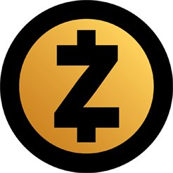

zcash(ZEC)-匿名性实现原理及项目追踪分析
=====

概述
-----
* Zcash（ZEC）是一种去中心化的开源的隐式货币，于2016年10月推出，其主要重点是隐私保护和匿名交易。该项目使用一种称为“Zerocash”的技术，这是一种加密货币协议，不会显示块中的起始，目的地和付款金额; 相反，通过使用称为“零知识证明”的加密概念来证明交易的正确性。像比特币一样，Zcash是通过采矿生成的，总供应量为2100万枚。确认时间只有2.5分钟（比比特币快四倍），但是奖励最初设置为每个块12.5 ZEC（比特币的四分之一）。

基本信息
----
* 发行日期：2016-10-28
* 近7天涨幅：46.56%
* 市值排名：13
* 交易量排名：最近1天第9，最近7天第8，最近1月第12
* 交易量前三大交易平台：p网／云币／	Bitfinex
* 官网：[https://z.cash/](https://z.cash/)
* 钱包下载：[https://z.cash/download.html](https://z.cash/download.html)（钱包服务商JAXX支持ZEC）
* 区块链浏览器：[https://explorer.zcha.in/](https://explorer.zcha.in/)

市场关注度
-----
* 推特：1.54万
* github：2339
* reddit：1815

团队介绍(部分)
-----
* 创始人&CEO：Zooko Wilcox，在开放的去中心化系统、密码学、信息安全和创业公司领域有着超过20年的经验。他因DigiCash、Mojo Nation、ZRTP、“Zooko’s Triangle”、Tahoe-LAFS、BLAKE2和SPHINCS这些成果而知名。他也是Least Authority【[https://leastauthority.com/](https://leastauthority.com/)】的创始人和首席执行官。他也是推特达人（注：关注量1.36万）。

* 顾问团队：
 
 Gavin Andresen：比特币基金会首席科学家、前比特币首席开发者。他在软件开发领域有超过25年的经验，主导了许多项目，包括作为联合创始人创建的一家为盲人开发多人游戏的公司和TruCoin的首席开发者。
 
 Vitalik Buterin：以太坊的创始人和首席科学家。他也是比特币杂志的创始人和写作者，这是他在2011年进入密码学货币领域的起点。他对创建安全、高效和可信的系统感兴趣，也是密码学货币领域许多项目的顾问。
 
 
* 科学家团队：

  Eli Ben-Sasson：以色列理工学院计算机科学系的教授。他的研究包括证明系统的理论（数学）、实现和应用，包括零知识证明和概率可验证明。另外，他与别人共同创建了简洁计算完整性和隐私研究实验室（SCIPR），还是建立ZK系统的小组成员，ZK系统被学术版的Zerocash所采用。
 
 Alessandro Chiesa：来自 UC Berkeley 计算机系的教职人员。它在麻省理工获得学士和博士学位。他的研究专注于理论计算机科学和密码学，包括复杂理论和机制设计，对简洁的零知识证明感兴趣。他和其他创建了SCIPR实验室(一个跨学科的实验室专门研究密码学证明)，也是zkSNARK证明C++库libsnark的作者。
 

投资人
-----
* zcash获得数家机构投资者和几十位个人投资者投资，其中包括国内的分布式基金和个人投资者李笑来。

项目进展
-----
* 最近更新：2017/5/24更新至1.0.9版本，除了对Zcash代码库本身的改进外，还对持续集成（CI）系统进行了实质性的改进：升级了Buildbot框架，将CI代码模块化以便于维护，引入了“支持的vs不支持的”构建工作者框架，修复了覆盖分析，并增加了新的基准。这些变化能够增加对更多平台的支持，并进一步改进CI系统，同时对未来参考客户端版本的影响最小。

实现原理
-----
* Zcash是一个去中心化的开源密码学货币项目，通过使用先进的密码学技术提供交易隐私和可选择的透明性。Zcash支付被发布在一个公有区块链上，但是交易发送者、接收者和交易数额是保密的。

 Zcash基于同行评议的密码学研究，并且是由专注于安全的团队基于比特币核心代码开发的。对比特币的改进是增加了隐私性。Zcash使用先进的密码学技术，即零知识证明，最大程度地保护网络上交易的隐私，零知识证明是在不泄漏信息的情况下，生成证明，验证者通过验证证明确定是否正确。
 
 举个例子，如何在不给失主看钱包的情况下证明丢的钱包是其本人的？

 当A把钱包丢了，被B捡到后。A想从B那里把钱包取回时,在B不让A看到钱包的前提下，需要A“证明”钱包到底是不是A的。而这个“证明”过程就类似于“零知识证明机制”，下面就是一个模拟的“零知识证明机制”，B会向A提出至少16个的问题。

  问题1:B会问A钱包里有多钱？

 A回答有～～～钱。

 问题2:B又问钱包里还有什么东西？

 A回答有卡，有钱，有身份证，有名片。

 问题3:B又问都有什么卡？

 A回答有健身卡，有银行卡，有会员卡。

 问题4:～～～

 ……

 一系列的问题，来来回回这样问不同的问题16次以上，如果钱包真的是A的，那么A就会回答上来16次所有的问题，也就基本可以证明A就是钱包的主人。因为A每次交流猜中的概率只有1/2，所以如果A是假的，那么A全部猜对的概率是1/65536，也就是1/216的概率来说，理论上说这是极不容易发生的。

 在这整个还钱包的过程中A没有向B展示任何与钱包相关的东西，而A又证明了这个钱包是自己的，这个过程就是“零知识证明机制”

 Zcash 可以加密交易中的特定内容。由于交易信息是加密的，Zcash 协议使用了一个新颖的密码学技术来验证交易信息的真实性。

 Zcash使用一个被称为 zk-SNARK的零知识证明架构。这个框架允许网络在不公开交易参与方或者交易数额的情况下维护一个安全的账户余额账本。Zcash交易的元数据是加密的，而不是公开地展示交易参与方和交易数额，zk-SNARK被用来证明没有人进行欺骗或者偷窃。

 Zcash 同样可以像比特币一样使用户具有发送公开透明交易的功能。通过同时使用隐私地址和透明地址，用户可以选择使用隐私方式或公开方式发送 Zcash。从隐私地址向透明地址的的 Zcash 交易完成时，账户的资金将被揭露，而从透明地址向隐私地址的交易完成时，账户的资金将被隐藏。

块奖励 
-----
* ZCash 总量是 2100 万个币，每隔 2.5 分钟出一个块，每天 576 个块，区块大小是 2M。
 
 区块奖励分 2 个阶段：
 
 1、 慢慢开始挖矿阶段，为了照顾在开始阶段不懂挖矿的，ZCash 采用了慢慢开始挖矿机制，前 20000 个块的奖励比较少，线程递增到 12.5 个币。

  慢慢开始挖矿阶段也分 2 个阶段：

   (1) 前 10000 个块，块 1 的奖励是 0.000625 币，随着高度线性递增，增加幅度是 0.000625 币，块 9999 的奖励是 6.249375 币。

 (2) 块 10000～19999  ，块 10000 的奖励是 6.250625，随着高度线性递增，增加幅度是 0.000625 币，块 19999 的奖励是 12.5 币。

 前 20000 个块的奖励总量是 125000 币，相当于 10000 个块奖励是 12.5 个币的总量。产 生 10000 个块需要的时间大约是 17.3 天，缓慢挖矿的时间周（20000 个块）大约是 34.7 天。  

 2、 正常块奖励，从块 20000 开始，奖励是 12.5 个币，奖励按照每 840000 个块（每 4 年）减半，计算块 奖励时块高度减少 10000，即 940000 块是第一次减半，每隔 840000 个块减半，以此类推。  
 
创始人奖励 
-----
* 前 4 年（区块 0～840000）产生的区块奖励的 20%归 zcash 公司（总量的 10%），80%归矿工。4 年后的区块奖励全部归矿工。创建区块时，构造 2 个输出，分别给矿工、创始人，当广播区块后，其他节点接受区块时，检验区块有效性，当高度小于 840000 时，检验是否有对创始人的 20%的输出。创始人奖励地址采用 2/3 多重签名 FOUNDERS_REWARD_SCRIPT。  

难度调整 
-----
* 每产生一个区块都需要重新计算难度，难度计算基于前 17 个块（42.5 分钟），前 17 个区块的难度是固定的（powLimit），从第 18 个区块开始调整难度，最大值是 powLimit。详细计算过程参考 GetNextWorkRequired 函数。
Bitcoin 是每隔 2016 个块调整难度，关于 zcash 的每个块都要重新调整难度，github上有个讨论，[https://github.com/zcash/zcash/issues/147](https://github.com/zcash/zcash/issues/147 )

保护隐私技术比较 
-----
* 目前市场上有 3 种保护隐私的币，分别是达世币 DASH、门罗币 XMR、Z 币 ZCash，我们这里只简单概述，后面会详细介绍另外两个币种，给大家参考对比。

 1、 达世币（暗黑币改名叫达世币） DASH 采用的混币 CoinJoin 的方案，把一些交易混合在一起，增加追踪的难度。 
  
 2、 门罗币 XMR， XMR 采用了环签名，签名者利用自己的私钥以及环成员的公钥进行签名，验证者只能确定该签名来自环中的某个成员，但无法确定签名者的真实身份。 
 
 3、 Z 币ZCash的交易采用了零知识证明，隐藏交易信息。  这 3 种技术相比较来看，ZCash 的隐私保护性更好。
 
 后面我们将会对dash和xmr进行详细的分析，给大家做对比，请继续关注小密圈（ID：61818889）。
  
风险 
------
* ZCash 目前是由公司开发的，公司具有绝对的话语权，后续公司会成立基金会，ZCash 的开发交给基金会推进。如果ZCash社区与公司、基金会出现意见分歧，而代码是开源的， 可以硬分叉。 比如：有人对创始人奖励不满意，已经提议去掉创始人奖励。  

* ZCash 的顾问包括：前任比特币核心开发人员 Gavin、eth 创始人 Vitalik Buterin，zcash 的 发展会受到这 2 个人的影响。 比如：区块大小 2M 源于 bitcoin classic。 参考 Github上的讨论: [https://github.com/zcash/zcash/issues/765 ](https://github.com/zcash/zcash/issues/765)

最新消息
-----
  * 摩根大通，这家世界上最大的银行已与Zcash的创造团队达成了合作，为该银行的企业级区块链Quorum提供一层新的隐私层。

 Zcash首席执行官Zooko Wilcox在Consensus 2017大会上公布了这一消息，摩根大通将整合ZSL这种零知识证明安全层，旨在进行安全且匿名的区块链结算交易。

 而零知识安全层正是匿名加密货币Zcash的关键所在，这项技术本身的目的是让网络安全地解决数字资产的移动。

**关于币种分析文章，请关注小密圈ID：61818889，小密圈将作为第一发布平台，也可添加微信 liqi_studio 进群交流。**

