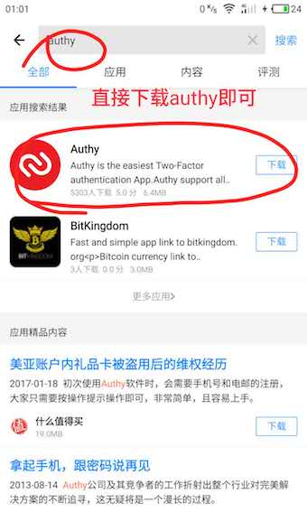

2FA(二次验证,谷歌验证器,Authy验证器)使用教程与注意事项
=====

`2FA - 双因素验证(二次验证），以下简称 2FA。`

我们登录某个网站或服务时，传统方式一般是使用 **用户名 + 密码** 的方式即可。但是，这种方式的安全性越来越被质疑，因为一旦密码泄露（用户本身或者网站漏洞等），你的账户、隐私甚至资金安全就会受到威胁。2FA 则是在原来的基础上，加入了额外的 Token 认证，一般来说这个 Token 是即时发送到你手机上的验证码，或者绑定账号后的动态码。

交易平台／代投平台因涉及大量加密货币资金，很容易成为恶意攻击的目标。因此，越来越多的交易平台为提高用户的账户和资金安全，都已经增加 2FA 验证功能，对于涉及到资金安全的操作（比如提币，交易等）一般会要求用户必须开启 2FA 才能进行。从技术上来说，2FA 的确能够大大提高账户的安全性（尤其是对于使用简单密码的用户），也建议大家将重要的账户开启 2FA 来给自己提供更多保障。

大部分网站在 2FA 功能页面默认会推荐大家使用谷歌验证器，这也是之前默认最常用的 2FA 工具软件。

注意：在平台开启 2FA 验证功能的二维码只会在初次绑定时显示一次，**如果使用谷歌验证器，一定要拍照或者截图备份二维码和密文**。以免手机误删或丢失而无法获取验证码，账户操作则大大受限。平台出于安全考虑，用户想要重制 2FA 功能一般会很麻烦，通常会要求提供可靠证明资料，且流程缓慢。

**在此，我们推荐大家使用Authy验证器，它提供了多重安全保障的跨设备跨平台同步密文的功能，解决了「谷歌身份验证器」只能保存密文到本地而需要用户手动额外备份的问题。**

Authy可以管理所有使用「谷歌身份验证器」的账号系统，是一款跨平台的、支持多个设备同时使用的2FA管理工具，是谷歌验证器的有力替代者。Authy的优点在于，它支持多设备同时使用，也可以快速在设备之间迁移、抹除，下面我们就来讲解使用Authy的流程及需注意的要点。

---------
一、下载软件
------
* Authy可以直接下载，谷歌验证器使用苹果手机可以直接下载，安卓手机需翻墙才能下载，比较麻烦，推荐使用Authy。
 
  

二 创建账号
----
* 首次使用 Authy 时，需要提供手机号和邮箱进行注册，并且需要对手机号进行验证。Authy 提供了短信和电话两种方式。

     

 
 
三 添加需要启用二次验证的账号
------
* 目前，**Authy 可以管理所有使用「Google 身份验证器」的账号系统**，包括 Gmail、Evernote、Facebook、Dropbox、LastPass等。
* **你需要在 PC 上登录你要开启 2FA 的账号，在设置中找到「开启两步/二次验证」的选项，再通过二维码将 Authy 与它们关联，整个过程很像微信扫一扫登录网页版。**下面具体来看看吧。
  
  

* **二维码只会在初次绑定时显示一次（使用 Authy 因为软件会帮你同步，可以不保存二维码和密文，当然保存也可以多一个保障）**：
  
  
  
  

四 支持 Touch ID 和多设备同步
-----
* Authy 比 Google 身份验证器强大之处，正在于可以提供本地的安全保护和更方便的多设备同步。如图所示，你可以开启 Touch ID 验证，每次进入 App 时需要指纹验证，彻底杜绝了手机丢失后 Token 的外泄。另一方面，Authy 支持多操作系统，覆盖了所有的主流操作系统，如 Windows，OS X，Linux，Android，iOS，甚至还支持黑莓。你可以方便地在设备之间迁移数据，或是在设备不可用后从授权名单中清除。

  
 

* **本圈(ID:61818889 加密数字货币研究院)致力于研究有实际应用价值，有技术创新的币种，发布研究报告，为价值投资者提供投资参考。**

