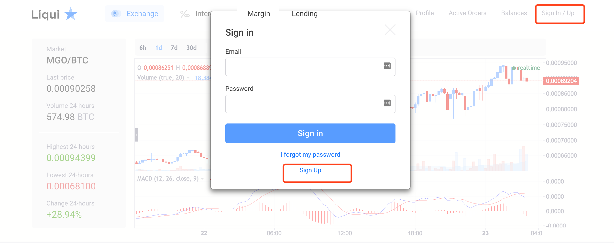

国外加密货币交易平台L网（liqui.io）使用教程
=====

一 准备工作
-----
* 推荐使用谷歌浏览器，谷歌浏览器有翻译功能，可以帮助我们解决语言障碍。
第一步打开网址：https://liqui.io/，首页如下

二 注册
----
* 点击右上角“Sing In／Up”，如下：

* 按照要求，输入注册信息，如下：

 邮箱确认如下：
 
 
 
 
 
 

三 充币／提币
-----
* 登陆账户后，点击右上角“balance”，如下：

 
 
* 点击“+”，显示你的充币地址，如下（把你的地址复制粘贴到你要转出的钱包或者交易平台的转出地址一栏里，就可以了）：
 

四 交易
----
* 等代币到账后就可以交易了，需要注意这是国外交易网站，不能直接把币卖成人民币，只能选择币币交易，将你的代币卖出换成币，再转回国内的交易所卖掉换成人民币。
   
   
   
 

* 以上就是国外交易网站[L网https://liqui.io/](https://liqui.io/)的使用教程。
* **L网的使用较为简单，教程也很详细，相信大家都能轻松使用L网交易。想知道更多国外交易平台如何使用，在小密圈(ID:61818889 加密数字货币研究院)内搜索“教程”可见。**
* **本圈(ID:61818889 加密数字货币研究院)致力于研究有实际应用价值，有技术创新的币种，发布研究报告，为价值投资者提供投资参考。**

