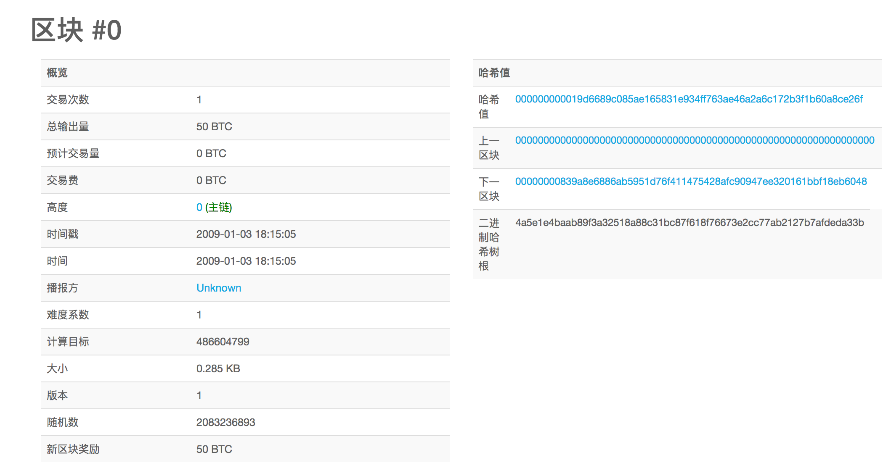
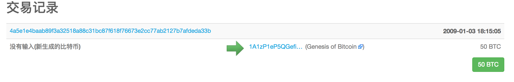

干货 | 比特币创世区块里隐藏的秘密
=====

* 比特币区块链里的第一个区块创建于2009年（北京时间2009年1月4日02:15:05），被称为创世区块。它是区块链里面所有区块的共同祖先，这意味着你从任一区块，循链向后回溯，最终都将到达创世区块。

* 因为创世区块被编入到比特币客户端软件里，所以每一个节点都始于至少包含一个区块的区块链，这能确保创世区块不会被改变。每一个节点都“知道”创世区块的哈希值、结构、被创建的时间和里面的一个交易。因此，每个节点都把该区块作为区块链的首区块，从而构建了一个安全的、可信的区块链的根。新版本的比特币系统将它设定为0号区块，而旧版本的比特币系统设定它的序号为1
 
 
* 创世区块的哈希值为：

`000000000019d6689c085ae165831e934ff763ae46a2a6c172b3f1b60a8ce26f`

* 你可以在任何区块浏览网站搜索这个区块哈希值，如blockchain.info，你会发现一个用包含这个哈希值的链接来描述这一区块内容的页面：

   * https://blockchain.info/block/000000000019d6689c085ae165831e934ff763ae46a2a6c172b3f1b60a8ce26f

   * https://blockexplorer.com/block/000000000019d6689c085ae165831e934ff763ae46a2a6c172b3f1b60a8ce26f

* 创世区块包含一个隐藏的信息。中本聪在创世区块里留下一句永不可修改的话:

>The Times 03/Jan/2009 Chancellor on brink of second bailout forbanks（2009年1月3日，首相正处于实施第二轮银行紧急援助的边缘）

* 这句话是泰晤士报当天的头版文章标题，引用这句话，既是对该区块产生时间的说明，也可视为半开玩笑地提醒人们一个独立的货币制度的重要性，同时告诉人们随着比特币的发展，一场前所未有的世界性货币革命将要发生。

《泰晤士报》当天头版

* 区块链的时间戳服务和存在证明，第一个区块链产生的时间和当时正发生的事件被永久性的保留了下来。

* 创世块的收益不可能被花掉，因为创世块是用代码表示的(这个巧合可能是故意的)，尽管如此，其50BTC收益还是被发送到地址：1A1zP1eP5QGefi2DMPTfTL5SLmv7DivfNa

* 原因如下：比特币客户端把区块和交易分开存贮在两个数据库中，当客户端发现区块数据库为空时，用代码直接生成一个创世块，但是没有生成这个交易，所以客户端中的交易数据库中是没有发送到上述地址这个交易的，因而一旦收到要花掉该收益的交易时，都会拒绝，所以无法得到任何确认，就花不掉这50个币。出现这种情况很可能是中本聪故意的。
 
* 尽管很大的可能是中本聪故意的，但这完全可以看作一个无害的bug。无害是因为这个bug除了导致中本聪不能花这50个币以外，没有其他的副作用，虽然中本聪放弃了使用权，但是其所有权还在。这就是比特币有趣的特性。因为比特币的“数据库”有不可篡改性，不管创世块的内容只有一份拷贝还是有一亿份拷贝，其内容的唯一确定性是无可质疑的，而且人人可以验证。因此只要中本聪使用那个地址对应的私钥签名一份声明，那么质疑这份声明真实性的唯一理由就是秘钥被泄漏了，这种可能性非常之小。从另外一个角度看，这也防止了有人冒充中本聪，因为中本聪本人可以随时发表声明。

